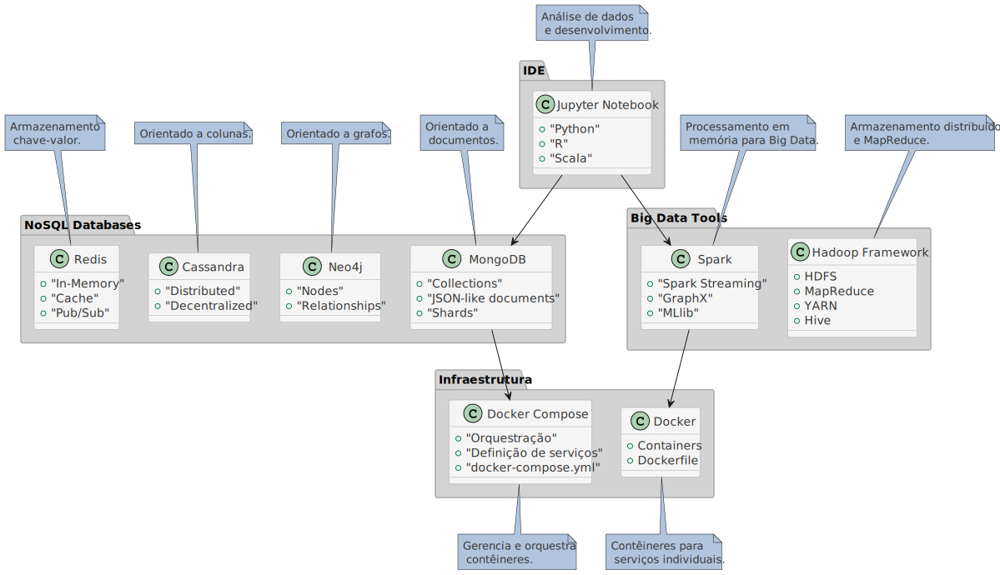

# Laboratórios da Disciplina

Olá, estudante! Seja bem-vindo aos laboratórios da disciplina de Big Data e NoSQL. Este repositório foi desenvolvido para facilitar a configuração e o gerenciamento das ferramentas que utilizaremos. No cenário atual de Tecnologia da Informação e Comunicação (TIC), enfrentamos o desafio de armazenar e gerenciar quantidades massivas de dados, como os mais de 2,5 quintilhões de bytes gerados diariamente por redes sociais, transações financeiras, sensores IoT e dispositivos conectados. O conceito de Big Data surge em resposta a essa demanda, caracterizado não apenas pelo grande **Volume**, mas também pela **Velocidade** com que os dados são gerados e processados, a **Variedade** de formatos e fontes, a **Veracidade** dos dados e, finalmente, o potencial **Valor** que podem agregar quando analisados corretamente. Nesse contexto, os bancos de dados, especialmente os NoSQL (Not-only SQL), emergem como soluções otimizadas para lidar com estas características

## 1. Instruções Gerais 

Ao longo do curso, abordaremos os conceitos, infraestrutura e aplicações relacionados a estes temas. Siga atentamente as instruções abaixo para configurar seu ambiente. 

## 2. Desafios de Big Data e NoSQL

Cada desafio é uma experiência prática, onde você aplicará o conhecimento adquirido para explorar novas ferramentas e terá a oportunidade de aprofundar seu aprendizado de forma progressiva, empregando técnicas para resolução de problemas reais comumente vistos no mercado.  

| #  | Atividade                                                                            | Desafio                                                    | Prazo      |
|----|--------------------------------------------------------------------------------------|------------------------------------------------------------|------------|
| 01 | [MongoDB](./mongodb/)                                                                | Fundamentos do MongoDB e Administração de Dados            | 26/02/2025 |
| 02 | [Jupyter & MongoDB](./jupyter/)                                                      | Integração de Ambientes e Manipulação de Dados com MongoDB | 05/03/2025 |
| 03 | [MongoDB & Python](https://www.kaggle.com/code/ganu1899/mongodb-with-python)         | Prática com MongoDB e Python no Kaggle                     | 12/03/2025 |
| 04 | [Censo IES 2022 e 2023](./jupyter/#4-limpeza-preparação-e-importação-de-dados-reais) | Análise de Dados do Censo IES                              | 19/03/2025 |

## 3. Infraestrutura dos Laboratórios

Considerando o tempo e recursos disponíveis, optamos por apresentar o curso sobre uma infraestrutura baseada na ferramenta Docker, uma plataforma leve de virtualização que permite empacotar aplicações e todas as suas dependências. Contudo, diferentemente de máquinas virtuais, que replicam um sistema operacional inteiro, o Docker compartilha o kernel do sistema host, tornando a execução de containers mais leve e eficiente (bibliotecas, configurações e código) em ambientes isolados, chamados containers. Esses containers são altamente portáveis e podem ser implantados, executados e rapidamente eliminados em qualquer sistema operacional compatível. Trata-se de uma solução amplamente adotada no mercado para criar ambientes replicáveis e consistentes, eliminando a necessidade de configurar e instalar manualmente cada aplicação em diferentes máquinas.

Nos sistemas Microsoft Windows, recomenda-se a utilização do WSL (Windows Subsystem for Linux) para a instalação do Docker. O WSL é um recurso nativo do Windows que permite a execução de distribuições Linux sem a necessidade de emulação ou virtualização completa, como o Microsoft Hyper-V ou Oracle VirtualBox. Projetado para facilitar o desenvolvimento de software no Windows, o WSL oferece uma integração simplificada entre os dois sistemas operacionais, tornando o uso do Docker mais eficiente e acessível.

O uso do Docker, em conjunto com o WSL, é essencial para nossos laboratórios, pois garante a replicabilidade do ambiente de desenvolvimento, independentemente do sistema operacional usado por cada estudante.

**Nota**: Usuários de sistemas baseados em Linux ou MacOS não precisam utilizar o WSL, pois esses sistemas já possuem suporte nativo ao Docker. Para executar containers, basta instalar o Docker diretamente, sem a necessidade de qualquer subsistema ou ferramenta adicional.

### Passo 1: Verificação dos Requisitos

Certifique-se de que você está utilizando o sistema operacional Windows 10 ou uma versão superior, e que o recurso de virtualização de hardware está habilitado. Para verificar, acesse a BIOS/UEFI do seu computador pressionando a tecla apropriada (geralmente F2, F10, DEL ou ESC) durante a inicialização. No menu de configurações, procure por uma opção como "Intel VT-x" (para processadores Intel) ou "AMD-V" (para processadores AMD) e certifique-se de que esteja ativada.

### Passo 2: Ativação do WSL
Abra o aplicativo **PowerShell ISE**, como administrador, e execute os comandos abaixo:

```bash
# Ativa o subsistema Windows para Linux
dism /online /enable-feature /featurename:Microsoft-Windows-Subsystem-Linux /all /norestart

# Ativa a plataforma de máquina virtual necessária para o WSL 2
dism /online /enable-feature /featurename:VirtualMachinePlatform /all /norestart

# Instala o WSL
wsl --install

# Define a versão 2 do WSL como padrão
wsl --set-default-version 2
```

**Nota:** Caso tenha encontrado algum erro ou qualquer dificuldade, você pode verificar na BIOS/UEFI de seu dispositivo se o recurso de virtualização está ativado (`VT-x` para processadores Intel, como `Core i3`, `i5`, `i7`, etv; e `AMD-V` para processadores `Ryzen 5`, `Ryzen 7`, etc). Se não conseguir avançar, entre em contato com o professor para obter orientação sobre a instalação.

### Passo 3: Escolha de uma Distribuição

- Caso ainda não utilize WSL com uma distribuição Linux embarcada, instale uma distribuição pelo aplicativo **Microsoft Store** ou via **linha de comando (CLI)**. Recomenda-se instalar o **Ubuntu 24.04**.

- Caso prefira realizar a instalação de forma rápida via CLI, execute o comando abaixo diretamente no **PowerShell ISE**, execute o comando abaixo: 

<!--
wsl -l -o
-->

```bash
# Instala o Ubuntu 24.04
wsl --install -d Ubuntu-24.04

# Define o Ubuntu 24.04 como distribuição padrão ao executar o comando wsl. 
wsl --setdefault Ubuntu-24.04
```

- Finalizada a instalação, reinicie o seu computador. 

### Passo 4: Configuração Inicial

- Inicie o aplicativo WSL e configure o usuário e a senha da distribuição. Depois disso você terá acesso a um kernel e a um terminal Linux. Você pode invocar o Powershell ou Terminal Windows e acionar o comando `wsl` para ter acesso ao ambiente. 
- Além do acesso via CLI, você também pode navegar via nas pastas e arquivos do ambiente Linux através do Windows Explorer (ícone do pinguim), diretamente na pasta da sua distribuição.
- Caso prefira uma interface gráfica (GUI), considere o uso do [Visual Studio Code (VS Code)](https://code.visualstudio.com/), que permite estabelecer uma sessão de terminal com seu ambiente WSL. Esta alternativa pode ser mais intuitiva e amigável para edição de arquivos, unificando sua experiência de desenvolvimento e administração. Procure o professor caso tenha dúvidas na utilização dessa ferramenta.

### Passo 5: Instalação do Docker

- O Docker Desktop for Windows fornece uma interface gráfica e integra o Docker ao sistema, facilitando a execução e o gerenciamento de containers diretamente no Windows.
- Baixe e instale o [Docker Desktop for Windows](https://docs.docker.com/desktop/install/windows-install/#:~:text=Docker%20Desktop%20for%20Windows%20%2D%20x86_64). Após a instalação, o Windows pode solicitar que você faça o logout e o login novamente para aplicar as alterações. 

### Passo 6: Utilização do Ambiente

- Ao longo do curso, você será guiado pelo Professor nas atividades práticas que envolverá o conteúdo das subpastas deste repositório.
- Para começar, inicie o Docker Desktop e, depois disso, o aplicativo WSL ou, se preferir, o terminal Linux diretamente a partir do VS Code. 
- Para quem está em sua primeira experiência com terminal Linux, segue um glossário com os comandos básicos: 

### Comandos Básicos

| Comando | Descrição                                              | Exemplo                                |
|---------|--------------------------------------------------------|----------------------------------------|
| `whoami`| Exibe o nome do usuário atual                           | `whoami`                               |
| `pwd`   | Mostra o diretório atual                                | `pwd`                                  |
| `history`| Exibe o histórico de comandos                          | `history`                              |
| `cd`    | Navega entre diretórios                                 | `cd /home`                             |
| `ls`    | Lista arquivos e diretórios                             | `ls -la`                               |
| `mkdir` | Cria um novo diretório                                  | `mkdir nova_pasta`                     |
| `cp`    | Copia arquivos ou diretórios                            | `cp arquivo.txt /caminho/destino/`     |
| `mv`    | Move ou renomeia arquivos e diretórios                  | `mv arquivo.txt /caminho/destino/`     |
| `rm`    | Remove arquivos ou diretórios                           | `rm arquivo.txt`                       |
| `cat`   | Exibe o conteúdo de um arquivo                          | `cat arquivo.txt`                      |
| `grep`  | Pesquisa por padrões em arquivos                        | `grep "termo" arquivo.txt`             |
| `vim`   | Editor de texto no terminal                             | `vim arquivo.txt`                      |
| `chmod` | Altera permissões de arquivos                           | `chmod 755 arquivo.txt`                |
| `chown` | Modifica o proprietário de um arquivo ou diretório      | `chown usuario:grupo arquivo.txt`      |
| `ps`    | Lista processos em execução                             | `ps aux`                               |
| `ping`  | Testa a conectividade com um host                       | `ping google.com`                      |
| `wget`  | Baixa conteúdo da web                                   | `wget http://exemplo.com/arquivo.zip`  |


### Conclusão

Pronto! Agora seu ambiente está preparado para nossos laboratórios. A partir daqui, você poderá seguir as instruções do professor para completar os exercícios práticos. Se surgir qualquer dúvida, consulte os materiais de apoio indicados no Moodle e neste repositório. 

## 4. Configuração Alternativa de Infraestrutura

Visando uma experiência mais uniforme, disponibilizamos como alternativa, uma máquina virtual (VM) pré-configurada. Essa abordagem assegura que todos iniciem o curso com o mesmo ambiente e configurações. Embora o Docker possa ser executado diretamente em diversos sistemas operacionais, essa padronização é necessária para viabilizar o processo de suporte e oferecer soluções mais ágeis e consistentes diante de eventuais desafios técnicos.

<!-->No entanto, valorizamos a autonomia de cada estudante, especialmente quando se trata da prática em seus computadores pessoais. Se você já está familiarizado com o Docker e deseja executá-lo nativamente em seu sistema operacional, este repositório está preparado para essa alternativa. Além disso, para os usuários de hardware recente da Apple, como o M2, essa opção é particularmente relevante, devido a possíveis incompatibilidades com versões do VirtualBox originalmente desenvolvidas para ambientes x86_64.-->

No caso dos usuários de Windows, que preferem evitar VMs devido a limitações de recursos, especialmente quando o dispositivo possui menos de 6GB de RAM, a infraestrutura depende Windows Subsystem for Linux (WSL) que apresentamos cima, e acaba sendo a alternativa mais interessante. No entanto, é importante lembrar que o WSL, embora eficiente, não oferece todas as vantagens de um sistema Linux completo e apresenta algumas nuances entre suas versões (WSL e WSL 2). Se você quiser se especializar no desenvolvimento de aplicações e infraestrutura pronta para execução em datacenters, também pode optar por instalar um sistema baseado em Linux em seu equipamento. 

### 4.1. Sobre o Oracle Virtual Box e a imagem OVA

Oracle VirtualBox é um software de virtualização de código aberto que permite executar vários sistemas operacionais em uma única máquina física. Com ele, é possível criar e gerenciar máquinas virtuais, cada uma com seu sistema operacional, aplicativos e arquivos em um ambiente isolado. Ele é compatível com diversos sistemas, como Windows, Linux e MacOS.

OVA (Open Virtual Appliance) é um formato de arquivo para máquinas virtuais, contendo toda a configuração e discos virtuais necessários. Ele simplifica a portabilidade e implantação de ambientes virtualizados, permitindo importações fáceis em plataformas como o VirtualBox.

Utilizando um arquivo OVA, é possível distribuir ambientes pré-configurados, assegurando que os usuários tenham um ambiente consistente, independentemente da localização de execução. A imagem OVA fornecida já vem equipada com ferramentas como `docker`, `docker-compose`, `git` e `ssh`, otimizando a configuração dos ambientes de laboratório.

### Como Usar:
1. Baixe a imagem OVA através deste [link](https://1drv.ms/f/s!As9_hcVH7a82gpovWfhahtGkRSmriA?e=vFJ2u3).
2. Caso não esteja instalado, baixe o VirtualBox através deste [link](https://www.oracle.com/br/virtualization/technologies/vm/downloads/virtualbox-downloads.html). 
3. Escolha a versão correspondente ao seu sistema operacional e siga as instruções de instalação.
4. Execute o VirtualBox e clique em **Arquivo** > **Importar Appliance**.
5. Selecione o arquivo OVA baixado e siga as instruções na tela.
6. Após a importação, dimensione os recursos de memória compatíveis com o laboratório ou computador pessoal. A imagem vem pré-configurada com 512MB de RAM, o que é inicialmente suficiente para prosseguir com nossos laboratórios. 
7. Em configurações da VM, pode ser necessário alterar a porta USB para suporte à versão 1.1 ao invés da 2.0.
8. Configure a placa de rede em modo [NAT](https://www.simplified.guide/virtualbox/port-forwarding#:~:text=Right%20click%20on%20the%20virtual%20machine%20and%20click,of%20the%20window.%20Click%20on%20Port%20Forwarding%20button).
9. Inicie a máquina virtual (VM). 

### Credenciais para acesso à VM:

- **Usuário:** labihc
- **Senha:** L@b1hc

### 4.2. Compreendendo o modo NAT

NAT (_Network Address Translation_) é a implementação de um recurso para tradução de endereços de rede. No contexto do VirtualBox, ao configurar uma VM para usar NAT, você está permitindo que essa VM se comunique com redes externas, incluindo a Internet, usando o mesmo endereço IP (_Internet Protocol_) do host. Assim, a máquina _host_ (seu _desktop_ de laboratório ou _notebook_ pessoal) age como um _gateway_ e a VM parece estar atrás de uma rede privada.

Além de fornecer acesso à Internet, o recurso de NAT do VirtualBox também permite o redirecionamento de portas. Isso significa que você pode encaminhar o tráfego de uma porta específica no _host_ para uma porta na VM. Isso é bastante útil quando você deseja acessar serviços hospedados na VM, que poderão ser alcançados diretamente do _host_ ou a partir de outras máquinas na mesma rede, a exemplo das aplicações web e interfaces de gerenciamento com as quais iremos trabalhar no laboratório. 

### Como configurar o Redirecionamento de Portas:

1. **Abra o VirtualBox** e selecione a máquina virtual que você deseja configurar.
2. Clique em **Configurações** (ou _Settings_).
3. Na janela de configurações, vá para **Rede**.
4. Sob a aba **Adaptador 1** e certifique-se de que está configurado para **Conectado a: NAT**.
5. Clique em **Avançado** para expandir as opções.
6. Clique em **Redirecionamento de Portas**.
7. Na janela de redirecionamento de portas, você pode adicionar algumas regras para encaminhar portas da sua máquina host para a sua máquina virtual.

### Exemplo de Tabela de Configuração de Portas:

|    Nome da Regra     | Protocolo | Endereço IP do Host | Porta do Host | Endereço IP da VM | Porta da VM |
|----------------------|-----------|---------------------|---------------|-------------------|-------------|
| Acesso SSH           |    TCP    |      127.0.0.1      |      2222     |     10.0.2.15     |      22     |
| Acesso Jupyter       |    TCP    |      127.0.0.1      |      8888     |     10.0.2.15     |     8888    |
| Acesso Spark         |    TCP    |      127.0.0.1      |      8888     |     10.0.2.15     |     4040    |
| Acesso Mongo Express |    TCP    |      127.0.0.1      |      8081     |     10.0.2.15     |     8081    |
| Acesso Neo4j Browser |    TCP    |      127.0.0.1      |      7474     |     10.0.2.15     |     7474    |
| Acesso Neo4j Bolt    |    TCP    |      127.0.0.1      |      7687     |     10.0.2.15     |     7687    |

- **Nota**: Ao configurar o redirecionamento de portas, evite utilizar as portas 0-1023 (exceto 80 e 443, para aplicações web), pois elas são reservadas. A porta 2222 é comumente usada para SSH devido à sua semelhança com a porta padrão 22 e por estar acima da faixa de portas reservadas, reduzindo a possibilidade de conflitos. Sempre certifique-se de que a porta escolhida **não esteja em uso**. Ferramentas nativas do sistema operacional, como `netstat`, podem ajudar na verificação. 

### 4.3. Descrição das Ferramentas Utilizadas

No cenário atual de Big Data, é evidente a necessidade de plataformas integradas que consigam gerenciar, processar e analisar grandes volumes de dados de diversas fontes. A ideia de um Data Lake ou Data Lakehouse é central para essa abordagem, onde os dados são armazenados em sua forma bruta e processados conforme a necessidade, em vez de serem pré-processados em silos de dados. A combinação de ferramentas como Spark, Hadoop, e bancos de dados NoSQL, numa infraestrutura orquestrada pelo Docker e Docker Compose, pode ser vista como uma representação básica de uma plataforma Data Lakehouse, que visa otimizar o fluxo de dados, desde a ingestão até a análise. 

Diante da quantidade de informações e ferramentas envolvidas, é natural temer essa certa complexidade inicial. No entanto, o objetivo não é dominar de imediato todas as técnicas e tecnologias envolvidas, mas proporcionar uma clara compreensão dos conceitos fundamentais e apresentar ferramentas fundamentais no panorama atual da indústria em se tratando de engenharia e ciência de dados. Não se preocupe, cada tópico será abordado de forma gradual, garantindo o suporte necessário e o esclarecimento de dúvidas ao longo do processo de aprendizagem. Com dedicação e tempo, essa complexidade inicial dará lugar a uma compreensão cada vez mais profunda e intuitiva. A seguir, apresentamos um diagrama que representa a arquitetura de referência da plataforma que estamos construindo: 



Dentro deste projeto, temos diversos diretórios, cada um representando um ambiente específico:

### Jupyter/Spark
Neste diretório, você encontrará o ambiente com Jupyter Notebook e Spark. 

- **Jupyter Notebook**: É uma aplicação web que permite criar e compartilhar documentos que contêm código ativo, equações, visualizações e texto. Muito usado para análise de dados.
  
- **Spark**: Um framework de processamento de dados rápido, baseado em memória, muito utilizado atualmente para big data analytics.

### Hadoop
Neste diretório, você encontrará o ambiente para o ecossistema Hadoop. 

- **Hadoop**: Um framework de código aberto para armazenamento distribuído e processamento de conjuntos de big data, usando o modelo de programação MapReduce.

### MongoDB
Neste diretório, você encontrará o ambiente para o MongoDB.

- **MongoDB**: É um banco de dados NoSQL baseado em documentos, onde cada registro é um documento, e sua estrutura de dados é composta por pares de chave e valor agrupadas em coleções.

### Redis
Neste diretório, você encontrará o ambiente para o Redis.

- **Redis**: É um banco de dados NoSQL da família chave-valor, voltado ao armazenamento de estrutura de dados em memória. É conhecido por sua alta velocidade e flexibilidade em aplicações como cache e broker de mensagens. 

### Cassandra
Neste diretório, você encontrará o ambiente para o Cassandra.

- **Cassandra**: É um banco de dados NoSQL distribuído, orientado a colunas, projetado para gerenciar grandes volumes de dados em múltiplos servidores.

### Neo4j
Neste diretório, você encontrará o ambiente para o Neo4j.

- **Neo4j**: É um banco de dados NoSQL orientado a grafos, que permite modelar relacionamentos complexos por meio de padrões e estruturas de dados que utilizam os conceitos de nós e arestas. 

## 5. Preparando o Ambiente de Laboratório

### Docker:

Em contextos de Big Data, é comum a interconexão de diversos serviços. Por exemplo, uma pipeline de processamento de dados pode envolver o Spark para processamento em memória, o Hadoop para armazenamento distribuído e bancos de dados NoSQL como MongoDB, Redis, Cassandra e Neo4j para diferentes finalidades. Para desenvolver e testar as aplicações, é comumente utilizado um Jupyter Notebook. Configurar essa quantidade de serviços para trabalharem de modo integrado é desafiador.

O Docker surge como solução ideal, permitindo desenvolver e executar aplicações em contêineres. Esses contêineres são unidades padrão de software que contêm o código e todas as suas dependências, garantindo consistência em diferentes ambientes. Eles são leves, iniciam rapidamente e são altamente portáteis, facilitando a transição entre, por exemplo, um computador pessoal e um servidor ou ambiente de nuvem.

Importante destacar que, tanto as VMs quanto o Docker são utilizados para objetivos de virtualização, embora apresentem diferenças marcantes em suas abordagens. Enquanto as VMs emulam sistemas operacionais completos, oferecendo isolamento robusto e a capacidade de replicar ambientes completos e padronizados, o Docker adota uma abordagem de virtualização em nível de processo, onde os aplicativos são executados em contêineres isolados que compartilham o kernel do sistema hospedeiro.

### Docker Compose:

O Docker Compose é uma ferramenta do ecossistema Docker projetada para definir e gerenciar aplicações multicontêiner. Através do arquivo docker-compose.yml, é possível orquestrar aplicações complexas compostas por diversos contêineres. Com o comando `docker-compose up -d`, todos os contêineres especificados são iniciados simultaneamente, garantindo sua configuração e integração correta. 

Por exemplo, para uma aplicação que combina um ambiente com Jupyter e Spark, o Docker Compose elimina a necessidade de configuração manual de cada contêiner. Basta definir a configuração em um arquivo e ativá-la. 

Assim, simplificamos o processo de implantação e integração de ferramentas, reduzindo preocupações com procedimentos manuais. A utilização de uma imagem OVA padronizada potencializa o aproveitamento do poder computacional disponível no laboratório, que pode ser configurado como um grande sistema distribuído. 

### Usando o SSH: Guia Básico

SSH (_Secure Shell_), é um protocolo que viabiliza uma comunicação segura (criptografada/encapsulada) entre um computador cliente e um servidor remoto. Você pode logar diretamente com o comando `wsl` na sua instância ou, ainda, usar o SSH Remote para gerenciar a instância no Visual Studio Code. 

Já no VirtualBox (ambiente servidor), é praticamente mandatório o uso de conexões SSH ao invés da console física. Uma opção popular e confiável para realizar uma conexão via SSH em clientes Windows é o [Putty](https://www.putty.org/). A versão _portable_ pode ser obtida e usada diretamente em nossos laboratórios [aqui](https://1drv.ms/f/s!As9_hcVH7a82gpovWfhahtGkRSmriA?e=vFJ2u3). 

- **Nota**: Caso você já possua experiência com outras ferramentas de SSH ou tenha uma preferência específica, fique à vontade para usá-las.

### Benefícios: Conveniência e Eficiência

- **Copiar e Colar**: Ao trabalhar com SSH, é mais simples copiar logs de erros, colar comandos, scripts, código, ou até mesmo transferir arquivos entre o host e a VM (e vice-versa). Isso torna a execução de tarefas muito mais eficiente e minimiza erros manuais de digitação.

1. Para copiar, selecione o texto desejado com o botão esquerdo do mouse e clique com o botão direito para copiar. 
2. Para colar, clique com o botão direito do mouse no local desejado. 

- **Sessões e Multitarefa**: O SSH permite estabelecer múltiplas sessões em paralelo, o que facilita a execução de diversas tarefas simultaneamente. 

- **Superação das Limitações da Console Física**: A console física do VirtualBox pode ter certas limitações, como resolução de tela reduzida ou problemas no mapeamento de caracteres para interações com teclado em alguns sistemas. Usando SSH, você obterá uma interface padronizada, independente do software de virtualização em uso.

- **Padrão Profissional**: Ao se familiarizar com o SSH, você estará equipando-se com uma habilidade importante não apenas para este ambiente de laboratório, mas também em cenários profissionais abrangendo administração de sistemas, equipes de infraestrutura, DevOps, SRE e Cloud.

### Como se conectar ao ambiente virtual:

1. Execute o PuTTY e no campo `Host Name (or IP address)`, digite: `127.0.0.1`. No campo `Port`, digite: `2222`. Isso é possível pois configuramos previamente o NAT com redirecionamento de portas no VirtualBox, de modo a encaminhar a porta `2222` do _host_ para a porta `22` da VM. 

2. Certifique-se de que a opção `Connection type` esteja definida como `SSH`. Clique no botão `Open` na parte inferior da janela. Uma janela de terminal será aberta. 

3. Na primeira vez que você se conectar, pode ser solicitado que você confie na chave SSH da sua VM. Se isso acontecer, clique em `Yes` para aceitar a chave e continuar. 

4. Você será solicitado a fornecer um nome de usuário. Digite `labihc` e pressione `Enter`. Em seguida, será solicitada a senha. Digite `L@b1hc` e pressione `Enter`.

- **Nota 1**: No ambiente do laboratório trabalharemos predominantemente com o modo NAT e, em princípio, com apenas uma VM instanciada. A escolha de adotar NAT em laboratório é motivada por questões de isolamento e segurança, uma vez que este modo permite que a VM acesse a Internet (através do _host_), mas não torna a VM diretamente acessível de outras máquinas na rede externa. A reinicialização da VM não impacta a conexão SSH em função da configuração do modo NAT e redirecionamento de portas. Acessos às nossas aplicações e interfaces de gerenciamento via navegador seguem uma lógica similar, usando a URL (_Uniform Resource Locator_) `http://localhost:<numero_da_porta_redirecionadora>`.

- **Nota 2**: Em redes domésticas, utilizar o modo _Bridge_ pode ser uma alternativa interessante, pois ele integra a VM diretamente à rede local e dispensa as configurações de redirecionamento de portas, especialmente útil quando se trabalha com mais de uma VM instanciada. Isso implica que, para acessar serviços na VM, você usará o endereço IP da VM, por exemplo: `http://<ip_da_vm>:<numero_da_porta_da_vm>`. Este endereço IP também será necessário para futuras conexões SSH diretamente na porta `22`. Para conhecer o IP da VM, execute o comando `ifconfig` a partir de sua console física. 

### Como baixar e iniciar as aplicações: 

1. Depois de acessar o ambiente virtual, baixe os arquivos do projeto:

```bash   
   sudo su -
   cd /opt
   git clone https://github.com/klaytoncastro/idp-bigdata
```

2. Entre na subpasta de cada ambiente, construa e inicie os serviços usando o Docker Compose. Por exemplo, para o Jupyter/Spark:

```bash
   cd /opt/idp-bigdata/jupyter-spark
   docker-compose build
   docker-compose up -d
```

3. Para criar e alterar os arquivos de configuração diretamente na VM, recomendamos o uso do editor **Vim**. Este é um editor robusto e versátil, amplamente adotado em ambientes de terminal Linux. O Vim é uma ferramenta poderosa para administradores de sistemas e desenvolvedores, possibilitando que usuários experientes realizem edições com poucos comandos.

### Usando o Vim: Guia Básico

Neste guia, focaremos apenas em algumas operações básicas, tais como: abrir, editar e salvar arquivos. 

1. **Abrir um arquivo**
    ```bash
    vim <nome_do_arquivo>
    ```

2. **Modo de Inserção**

    Após abrir ou criar um arquivo com o Vim, você estará no modo normal. Para inserir ou editar texto, você deve entrar no modo de inserção pressionando `Insert`.

3. **Salvar alterações**

    Para salvar as alterações feitas no arquivo, primeiro pressione `Esc` para retornar ao modo normal, depois digite `:w` e pressione `Enter`.

4. **Sair do Vim**

    - Sem salvar as alterações: Pressione `Esc` (para garantir que você está no modo normal), depois digite `:q!` e pressione `Enter`.
    - Após salvar as alterações: Digite `:wq` e pressione `Enter` ou apenas `:x`.

5. **Editar texto**

    No modo de inserção (após pressionar `Insert`), você pode editar o texto como em qualquer outro editor. Quando terminar, pressione `Esc` para voltar ao modo normal.

6. **Exibindo Números de Linha**

    Para exibir os números de linha no Vim, no modo normal, digite:
    
    ```bash
    :set number
    ```
    - Isso é útil porque facilita a navegação, a leitura e a referência a partes específicas do arquivo, especialmente em arquivos grandes ou quando se está fazendo depuração de código.

7. **Deletar uma Linha**

    No modo normal, posicione-se na linha que deseja deletar e digite `dd`.

### Dicas 

- O Vim é uma ferramenta robusta, repleta de comandos e atalhos que podem otimizar sua produtividade ao editar arquivos em sistemas operacionais baseados em terminal. À medida que se familiariza com os comandos básicos, você descobrirá as potencialidades desta ferramenta. Se não estiver familiarizado com ambientes de terminal, lembre-se de que pode sair do Vim pressionando `Esc` e digitando `:q!`. Esse comando retornará ao terminal, ignorando quaisquer mudanças não salvas.

- Se você está **fora do laboratório**, em casa ou no escritório, pode preferir uma interface gráfica mais amigável. Neste caso, considere o uso do [Visual Studio Code (VS Code)](https://code.visualstudio.com/) com a extensão [SSH Remote](https://marketplace.visualstudio.com/items?itemName=ms-vscode-remote.remote-ssh), que permite estabelecer uma sessão [SSH](https://code.visualstudio.com/docs/remote/ssh) diretamente na IDE (Integrated Development Environment). Esta alternativa pode ser mais intuitiva para edição de arquivos, unificando sua experiência de desenvolvimento e administração.

- Considere o uso de plataformas de controle de versão, como o [GitHub](https://github.com), para gerenciar e rastrear as mudanças no seu código e colaborar com outros desenvolvedores. Isso facilita o fluxo de trabalho e a integração contínua.

- Para a transferência de arquivos entre o _host_ e a VM, pode ser interessante utilizar uma ferramenta com suporte a SFTP (Secure File Transfer Protocol), como o [Filezilla](https://filezilla-project.org/download.php).

- **Nota**: Discutiremos e apresentaremos a configuração, vantagens e desvantagens de cada uma destas abordagens em sala de aula. 
  
### Usando Docker e Docker Compose: Guia Básico

Recomenda-se a leitura da documentação oficial para se aprofundar, mas este guia básico é suficiente para iniciar a utilizar utilização das ferramentas. 

### Comandos do Docker:

1. **Baixar uma imagem do Docker Hub**
    ```bash
    docker pull <imagem>:<tag>
    ```

2. **Listar todas as imagens no seu sistema**
    ```bash
    docker images
    ```

3. **Rodar um contêiner a partir de uma imagem**
    ```bash
    docker run <opções> <imagem>
    ```

4. **Listar contêineres em execução**
    ```bash
    docker ps
    ```

5. **Listar todos os contêineres**
    ```bash
    docker ps -a
    ```

6. **Parar um contêiner**
    ```bash
    docker stop <contêiner_id_ou_nome>
    ```

7. **Visualizar logs de um contêiner**
    ```bash
    docker logs <contêiner_id_ou_nome>
    ```

8. **Remover um contêiner**
    ```bash
    docker rm <contêiner_id_ou_nome>
    ```

### Comandos do Docker Compose: 

1. **Iniciar serviços definidos no `docker-compose.yml` em modo interativo**
    ```bash
    docker-compose up
    ```

2. **Iniciar serviços definidos no `docker-compose.yml` em segundo plano**
    ```bash
    docker-compose up -d
    ```

3. **Parar serviços**
    ```bash
    docker-compose down
    ```

4. **Listar os serviços em execução**
    ```bash
    docker-compose ps
    ```

5. **Visualizar logs**
    ```bash
    docker-compose logs
    ```

### Limpeza de Imagens, Contêineres e Volumes: 

Na pasta `docker` deste repositório, você encontrará o script `docker-cleanup.sh` que faz a remoção de imagens antigas e desnecessárias. Isso pode ser útil para recuperar espaço no ambiente de desenvolvimento. 

1. Navegue até a pasta onde o script está localizado: 

```bash
cd caminho/para/pasta/docker
```

2. Para tornar o script executável, utilize o comando:

```bash
chmod +x docker-cleanup.sh
```

3. Execute o script:

```bash
./docker-cleanup.sh
```

- **Nota**: Este script remove recursos não utilizados e imagens antigas para recuperar espaço. Para evitar a remoção inadvertida de recursos importantes, certifique-se de entender o que ele faz antes de executá-lo. Lembre-se que, ao executá-lo, apenas os contêineres em execução serão mantidos no armazenamento da VM. 

### Desligamento Seguro do Ambiente 

Nas VMs (configuração alternativa), precisamos evitar desligamentos abruptos, seja por interrupções forçadas ou por encerramento inadequado do VirtualBox, podem afetar a consistência dos discos virtuais, levando à perda ou corrupção de dados e desestabilizando o ambiente. Por isso, ao concluir suas atividades, é fundamental executar o comando `shutdown -h now` a partir do terminal. Esse passo garante um desligamento apropriado e a integridade do sistema operacional da VM, incluindo os contêineres Docker. Assim, todas as alterações serão preservadas, assegurando que, ao reiniciar, o sistema retorne exatamente ao estado anterior, sem a necessidade de ajustes adicionais.

### Pronto! 

Agora você está com o ambiente preparado e pronto para começar os laboratórios. Em caso de dúvidas, não hesite em me contactar: [klayton.castro@idp.edu.br](klayton.castro@idp.edu.br). 
