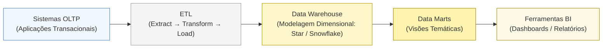
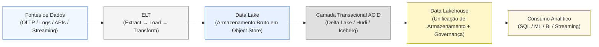
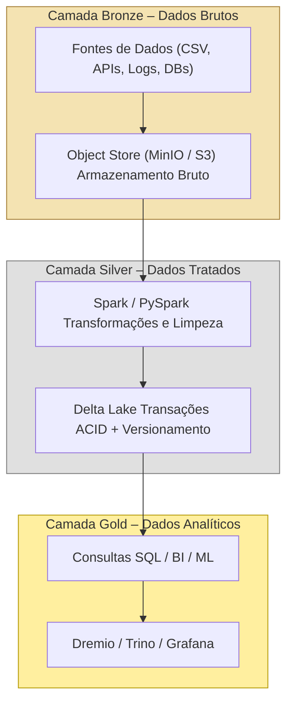
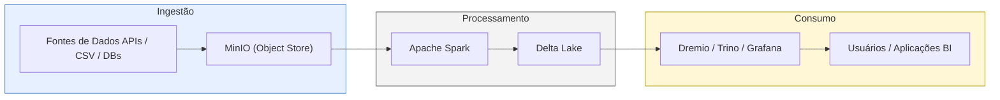

# Data Lakehouse: Transações ACID sobre Object Stores

>Após compreender o papel dos object stores (como MinIO e Amazon S3), que fornecem a base de armazenamento distribuído, e a função do Spark como motor de computação paralela em larga escala, avançamos para a camada transacional, que representa a evolução natural do armazenamento de dados não estruturados e semiestruturados em um Data Lake para um ambiente governado e consistente — o Data Lakehouse. Nesse modelo, controle de versões, isolamento transacional e integridade de esquema tornam-se requisitos fundamentais.

## 1. Visão Geral

Antes do advento dos Data Lakes, as organizações estruturavam seus dados em Data Warehouses (DW) — repositórios corporativos centralizados, otimizados para consultas analíticas sobre dados altamente estruturados e previamente modelados, normalmente com base em esquemas estrela (Star Schema) ou floco de neve (Snowflake Schema). O DW consolida dados de múltiplos sistemas transacionais e aplica regras rigorosas de qualidade, integridade e histórico.
Nele, os dados são organizados segundo a modelagem dimensional, técnica típica de Business Intelligence (BI), que estrutura informações em torno de um fato (evento mensurável) e de suas dimensões (atributos descritivos). O modelo estrela apresenta uma tabela fato central ligada diretamente às dimensões, enquanto o modelo floco de neve normaliza essas dimensões em múltiplas tabelas relacionadas, reduzindo redundâncias e favorecendo padronização. Assim, dentro de um DW, surgem os Data Marts, que são subconjuntos temáticos voltados a áreas específicas — como Vendas, Recursos Humanos ou Finanças — e fornecem visões departamentais derivadas do próprio Data Warehouse.

Em contraste, os Data Lakes foram concebidos para armazenar dados em estado bruto (estruturados, semiestruturados ou não estruturados), oferecendo alta escalabilidade e baixo custo, mas sem as garantias transacionais e de consistência típicas do DW. O Data Lakehouse surge como a convergência desses dois modelos: mantém a flexibilidade e a escala do Data Lake, mas incorpora as propriedades de governança, controle de esquema e consistência herdadas do Data Warehouse — eliminando a necessidade de manter infraestruturas separadas. Ocorre que, com a popularização dos Data Lakes e o amadurecimento das implementações em larga escala, tornou-se evidente a necessidade de oferecer, sobre os object stores, as mesmas garantias de consistência, integridade e versionamento antes restritas aos Data Warehouses. Embora eficientes para ingestão e armazenamento de grandes volumes de dados brutos, os Data Lakes careciam de controle transacional, validação de esquema e versionamento temporal, comprometendo a confiabilidade e reprodutibilidade das análises. Essa limitação resultava em corrupção de dados por concorrência, ausência de rollback, falta de time travel e anomalias estruturais propagadas.

Na prática, os Data Lakes funcionavam como depósitos sem governança: armazenavam grandes volumes de dados, mas sem controle sobre alterações.
O conceito de Data Lakehouse surge para corrigir essa limitação, transformando o object store em uma camada transacional governada, capaz de registrar quem alterou, o que alterou e quando. Assim, em termos conceituais, um Data Lakehouse é uma plataforma moderna de dados que combina a flexibilidade de armazenamento do Data Lake com as garantias de consistência e governança do Data Warehouse, unificando ambos em uma arquitetura única. Essa convergência entre flexibilidade (Data Lakes) e confiabilidade (Data Warehouses) impulsionou o surgimento de três frameworks de código aberto que se tornaram pilares das arquiteturas modernas de dados distribuídos: Delta Lake, Apache Hudi e Apache Iceberg. Essas soluções adicionam aos object stores as propriedades ACID (Atomicity, Consistency, Isolation, Durability), além de recursos como enforcement e evolução de esquema, versionamento temporal (time travel) e catálogos transacionais otimizados. Com isso, tornam-se possíveis operações como upserts, merges incrementais e integração de múltiplas engines analíticas em um mesmo repositório consistente e auditável.

Tradicionalmente, os processos de integração de dados seguiam o modelo ETL (Extract, Transform, Load), no qual os dados eram extraídos das fontes, transformados em um ambiente intermediário e apenas então carregados no Data Warehouse. Com o avanço das arquiteturas distribuídas e a ampliação da capacidade de processamento próximo ao dado, surgiu o paradigma ELT (Extract, Load, Transform), que inverte a ordem: os dados são primeiro carregados em estado bruto e as transformações ocorrem dentro da própria plataforma analítica, como o Data Lake ou o Lakehouse. Historicamente, também havia uma separação rígida entre sistemas OLTP (Online Transaction Processing) — voltados a transações rápidas e consistentes — e OLAP (Online Analytical Processing) — dedicados à consolidação e análise de grandes volumes históricos. Com a redução do custo de armazenamento e o avanço das arquiteturas distribuídas, o paradigma ELT consolidou-se como base dos pipelines modernos, permitindo que as transformações ocorram diretamente sobre os dados armazenados, sem a necessidade de um ambiente intermediário.


<!-- Figura 1. Arquitetura tradicional centrada em ETL → Data Warehouse → BI, com dados estruturados e transformações prévias ao carregamento. -->

A essência do Transactional Data Lake está justamente em aplicar, sobre o armazenamento distribuído — geralmente implementado em AWS S3, Azure Blob Storage, MinIO ou HDFS —, uma camada lógica que ofereça garantias ACID, conciliando escalabilidade com governança. O Apache Spark e os sistemas de arquivos distribuídos (como HDFS e MinIO) foram projetados para superar as limitações de desempenho e escalabilidade das arquiteturas centralizadas, explorando paralelismo e tolerância a falhas — fundamentos da engenharia de dados moderna.

Contudo, à medida que analistas e cientistas de dados passaram a utilizar os Data Lakes também para finalidades de governança e versionamento, o cenário se tornou caótico. A ausência de suporte nativo a transações ACID, catálogos consistentes de metadados e validação de integridade resultava em ambientes instáveis e de difícil manutenção. Os frameworks de Data Lakehouse — Delta Lake, Hudi e Iceberg — surgem, então, para restaurar previsibilidade, consistência e controle, unificando o mundo da engenharia de dados (OLTP/ELT) com as exigências analíticas de governança (OLAP/ETL). Essa evolução consolida um modelo unificado mais confiável para o processamento e a governança de dados em larga escala.


<!--Figura 2. Ecossistema moderno baseado em ELT e Data Lakehouse, no qual os dados são carregados em estado bruto e transformados sobre object stores com garantias ACID.-->

## 2. Frameworks de Data Lakehouse e Arquitetura Medallion

Para organizar a evolução dos dados dentro desse ecossistema distribuído e cada vez mais, surgiu o modelo de arquitetura conhecido como **Medallion**, que passou a ser amplamente adotado em arquiteturas modernas de Data Lakehouse. Criado pela Databricks em 2019, o modelo foi idealizado por Michael Armbrust e sua equipe como uma convenção arquitetural voltada à estruturação e à governança de dados em larga escala. Armbrust, pesquisador do AMP Lab da UC Berkeley, destacou-se desde 2008 por seus trabalhos em sistemas distribuídos e computação em nuvem, tendo contribuído para o desenvolvimento do Spark SQL e do Catalyst Optimizer, em conjunto com as pesquisas de Matei Zaharia e Ion Stoica — avanços que consolidaram o Apache Spark como principal motor analítico distribuído da última década.

A proposta da arquitetura Medallion reflete essa trajetória de amadurecimento conceitual do ecossistema Spark e da Databricks. Ela transpõe para o contexto do armazenamento em nuvem as boas práticas de consistência, versionamento e governança que faltavam aos data lakes tradicionais. Dividido em três camadas — Bronze, Silver e Gold — o modelo estabelece uma progressão de qualidade e confiabilidade dos dados, do estágio bruto até o consumo analítico. Na camada Bronze, concentram-se os dados brutos, diretamente extraídos das fontes, preservando integridade e rastreabilidade. A camada Silver aplica processos de limpeza, normalização e padronização, transformando os dados em estruturas analíticas consistentes. Por fim, a camada Gold consolida dados agregados e otimizados, prontos para alimentar painéis, relatórios ou modelos de machine learning. Do ponto de vista da engenharia de dados, a arquitetura Medallion não é apenas uma convenção organizacional, mas uma estratégia operacional de governança: separa responsabilidades, garante versionamento previsível e reduz o acoplamento entre ingestão, transformação e consumo.



Em termos práticos, em nosso último laboratório já estruturamos a camada Bronze, responsável pela captura e armazenamento dos dados brutos sobre o object store. Essa camada garante rastreabilidade e preservação da integridade, mas ainda carece de um mecanismo transacional capaz de assegurar consistência entre múltiplos processos de leitura e escrita. À medida que evoluímos para as camadas Silver e Gold, torna-se indispensável introduzir um framework de armazenamento confiável, que ofereça transações ACID, controle de versionamento e gerenciamento de metadados — elementos fundamentais para um Data Lakehouse plenamente operacional.

### 2.1. Comparativo entre Frameworks de Lakehouse

Entre as principais soluções que atendem a esses requisitos destacam-se o Delta Lake (Databricks), o Apache Hudi (Uber) e o Apache Iceberg (Netflix). Todos surgiram para suprir as limitações dos data lakes tradicionais, trazendo controle transacional e rastreabilidade sobre object stores. O Hudi prioriza a ingestão incremental e o atualização eficiente de registros, sendo amplamente usado em cenários de streaming analytics. O Iceberg, por sua vez, enfatiza a independência do catálogo de metadados e o suporte nativo a múltiplos motores de consulta, como Spark, Flink e Trino. Já o Delta Lake combina simplicidade operacional, profunda integração com o Spark e maturidade de ecossistema, o que o consolidou como a escolha predominante para a maior parte das arquiteturas modernas de Data Lakehouse.

| Aspecto                               | Delta Lake                                  | Apache Hudi                       | Apache Iceberg                           |
|---------------------------------------|---------------------------------------------|-----------------------------------|------------------------------------------|
| **Desenvolvedor Original**            | Databricks                                  | Uber                              | Netflix                                  |
| **Padrão de metadados**               | Arquivo `_delta_log` em JSON + Parquet      | Timeline com commits incrementais | Manifest + Metadata JSON + Snapshot      |
| **Transações ACID**                   | Sim (via log no storage)                    | Sim (timeline de commits)         | Sim (snapshot atomic)                    |
| **Schema enforcement**                | Sim                                         | Sim                               | Sim                                      |
| **Time Travel (versões antigas)**     | Sim (por versão ou timestamp)               | Sim (via instant)                 | Sim (via snapshot-id ou timestamp)       |
| **Merge/Upsert nativo**               | Sim (com `MERGE INTO`)                      | Sim (nativo e mais eficiente)     | Sim (a partir da versão 1.4              |
| **Indexação interna**                 | Não (usa estatísticas do Parquet)           | Sim (Bloom + Column stats)        | Sim (Manifest pruning)                   |
| **Integração com Spark**              | Altíssima (plugin nativo)                   | Alta                              | Alta                                     |
| **Integração com Presto/Trino/Flink** | Boa                                         | Muito boa                         | Excelente                                |
| **Modos de atualização suportados**   | Batch e Streaming (unificado)               | Batch e Streaming                 | Batch e Streaming                        |
| **Catálogo**                          | Hive Metastore, Glue, Unity Catalog         | Hive Metastore                    | Nessie, Glue, Hive, REST                 |
| **Governança e compatibilidade**      | Foco em Databricks                          | Foco em ingestão incremental      | Foco em interoperabilidade aberta        |
| **Ponto forte**                       | Estabilidade, maturidade e integração Spark | Ingestão contínua (CDC/Streaming) | Escalabilidade e governança multi-engine |
| **Licença**                           | Apache 2.0 (Linux Foundation)               | Apache 2.0                        | Apache 2.0                               |

### 2.2. Quando Utilizar Cada Framework?

- **Delta Lake**: é a melhor escolha para ambientes onde o Spark é predominante e busca-se simplicidade e confiabilidade. Permite escrita direta com sintaxe simples: `df.write.format("delta").save("s3://bucket/bronze")`

- **Apache Hudi**: Projetado para ingestão contínua e operações de upsert (atualizações e inserções incrementais), é amplamente utilizado em pipelines near real-time. Oferece mecanismos de indexação, rollback e commit timeline eficientes, embora exija maior complexidade de configuração. Indicado para demonstrar integração incremental e merge de fluxos de dados em ambientes produtivos.

- **Apache Iceberg**: Voltado para governança e compatibilidade multi-engine, o Iceberg oferece escalabilidade superior em metadados e suporte nativo a Spark, Flink, Trino, Presto e Snowflake. É o padrão emergente de interoperabilidade aberta, adotado por grandes empresas como Netflix, Apple e AWS. Indicado para Lakehouse corporativo e interoperável.

Em suma, embora Hudi e Iceberg ofereçam vantagens específicas — ingestão incremental e interoperabilidade multi-engine, respectivamente —, o Delta Lake destaca-se pela maturidade do ecossistema e pela integração profunda ao Apache Spark, fatores decisivos para sua adoção em ambientes educacionais e corporativos.

### 2.3. Casos Reais de Adoção e Resultados

Nesse cenário, cada um dos principais frameworks de Data Lakehouse surgiu em um contexto corporativo distinto, refletindo desafios reais de ingestão contínua, interoperabilidade multi-engine e controle transacional em ambientes de alta complexidade operacional. A seguir, exploraremos como esses frameworks consolidam o modelo Lakehouse e de que forma o padrão arquitetural Medallion organiza as etapas de maturação dos dados — da camada bruta (Bronze), passando pela refinada (Silver), até a analítica (Gold) — estabelecendo uma trilha lógica entre ingestão, padronização e consumo analítico. É fundamental destacar que a consolidação das tecnologias de Data Lakehouse não resulta apenas de avanços conceituais ou acadêmicos, mas de necessidades concretas enfrentadas por empresas que operam em escala massiva de dados. Cada framework nasceu em um contexto operacional específico, traduzindo as prioridades técnicas e de negócio de sua organização criadora: eficiência transacional e ingestão contínua no Uber (Hudi), governança e interoperabilidade multi-engine na Netflix (Iceberg) e integração nativa e previsibilidade sobre Spark na Databricks (Delta Lake).

| Case/Empresa   | Framework       | Contexto e Motivação | Solução Técnica | Impacto / Resultados |
|----------------|-----------------|----------------------|------------------|----------------------|
| **Uber**       | **Apache Hudi** | Criado para resolver o problema de atualização incremental e baixa latência em *data lakes*. As corridas e preços mudam constantemente, exigindo atualizações parciais sem reprocessar todo o histórico. | Introduziu o conceito de **commit timeline**, permitindo **upserts nativos**, **integração batch + streaming** e auditoria completa das alterações. | **Tempo de atualização:** de 6+ horas para minutos. **Custo de armazenamento:** redução de 60%. **Processamento:** passou de reprocessamento completo para incremental. |
| **Netflix**    | **Apache Iceberg** | Desenvolvido para lidar com milhões de arquivos Parquet distribuídos, evitando a lentidão e inconsistência do Hive Metastore. Criado para suportar múltiplos motores (Spark, Flink, Presto, Trino). | Implementou **snapshots atômicos**, **schema evolution estável** e **catálogo independente**, garantindo consistência entre diferentes engines. | **Leitura consistente**, **governança distribuída** e **eliminação de gargalos do Hive**. |
| **Databricks** | **Delta Lake** | Criado para simplificar a engenharia de dados sobre Spark, unificando *batch* e *streaming* com transações ACID. Tornou-se o padrão de fato para governança e versionamento em *object stores*. | Extensão nativa do Spark (`format("delta")`), com **API unificada**, **schema enforcement**, **time travel** e **checkpoints**. | **Governança completa**, **desempenho previsível** e **simples adoção em pipelines Spark existentes**. |
| **Shell**      | **Delta Lake** | Dados de sensores em poços de petróleo em tempo real. | Delta Lake com ACID e *time travel*.   | Auditoria completa de mudanças.    |
| **Rivian**     | **Delta Lake** | Telemetria de veículos elétricos em grande escala. | Pipeline unificado *batch* + *streaming*. | Análises em tempo real confiáveis. |
| **Comcast**    | **Delta Lake** | Dados de milhões de assinantes sob regras de compliance. | *Schema evolution* e governança centralizada. | Conformidade regulatória e previsibilidade operacional. |

Compreendidos os diferentes contextos e soluções, passamos agora ao aprofundamento do Delta Lake, que será adotado como base prática nesta disciplina.

## 3. Entendendo o Delta Lake

Imagine um cenário comum no Data Lake tradicional (com armazenamento S3/MinIO e processamento Spark):

- Falhas de Escrita: Um job do Spark falha no meio da execução, deixando o diretório de destino com arquivos parcialmente escritos e corruptos.
- Leituras Inconsistentes: Um usuário lê os dados enquanto um job está escrevendo novos arquivos, resultando em uma visão inconsistente e potencialmente incorreta dos dados.
- Atualizações e Deletes Ineficientes: Para fazer um UPDATE ou DELETE, você precisa reescrever toda a tabela (um diretório de arquivos Parquet/ORC), o que é custoso e propenso a erros.
- Evolução de Esquema Complexa: Alterar o esquema de uma tabela requer coordenação manual e cuidado extremo para não quebrar jobs de downstream.
- Qualidade de Dados: É difícil imponer qualidade de dados (e.g., colunas obrigatórias, valores únicos) na camada de armazenamento.

O Delta Lake resolve esses problemas ao trazer confiabilidade e desempenho de um data warehouse para a flexibilidade e economia de um data lake. Mantido pela Linux Foundation e fortemente associado à Databricks, o Delta Lake foi o primeiro framework amplamente adotado a implementar transações ACID sobre object stores. Seu núcleo baseia-se em um log transacional, denominado `_delta_log`, que registra de forma incremental todas as operações executadas em uma tabela. Esse log, composto por arquivos JSON (metadados de commits) e Parquet (snapshots otimizados), permite isolamento total entre sessões Spark, assegurando consistência e reprodutibilidade mesmo em ambientes distribuídos.

Em ambientes de dados dinâmicos, especialmente aqueles que recebem atualizações frequentes de diversas fontes, é comum a necessidade de combinar informações novas com registros já existentes. Tradicionalmente, isso exigiria duas operações distintas: INSERT, para adicionar novos dados, e UPDATE, para modificar os existentes. Para simplificar esse processo, surgiu o termo UPSERT — uma junção de UPDATE e INSERT — que designa uma operação capaz de atualizar o que já existe e inserir o que ainda não existe, de forma automatizada e atômica.

No Delta Lake, cada escrita ou atualização gera uma nova versão do log, o que viabiliza recursos como time travel, auditoria e recuperação de estados anteriores — características ausentes nos data lakes tradicionais. Essa funcionalidade é implementada por meio do comando MERGE INTO, que compara uma tabela de origem (source) com uma tabela de destino (target). Quando há correspondência entre os registros (por exemplo, mesmo identificador), o dado é atualizado; quando não há, é inserido. Essa operação é fundamental em pipelines incrementais ou de Change Data Capture (CDC), pois permite aplicar modificações contínuas — como inclusões, correções e atualizações — sem necessidade de reprocessar todo o conjunto de dados, mantendo a consistência e eficiência do ambiente.

Assim, ao combinar desempenho, governança e compatibilidade com o ecossistema Spark, o Delta Lake tornou-se a base conceitual e prática das arquiteturas Lakehouse modernas, oferecendo as seguintes funcionalidades:

- Transações ACID completas sobre object store;
- Time Travel nativo via `versionAsOf` ou `timestampAsOf`;
- Schema enforcement e schema evolution controlados no próprio log;
- Compatibilidade total com Apache Spark e integração com Presto, Trino, Hive e Flink;
- Vacuum e checkpointing para otimização de metadados;
- Merge e Upsert nativos (`MERGE INTO`) — recurso essencial em pipelines CDC (Change Data Capture). 

A arquitetura do Delta Lake é fundamentada em um modelo de armazenamento transacional baseado em logs, projetado para oferecer consistência, isolamento e versionamento sobre object stores como S3, ADLS ou MinIO. Diferentemente dos data lakes convencionais, que armazenam apenas arquivos Parquet ou ORC sem metadados de controle, o Delta Lake adiciona uma camada de metadados transacionais, responsável por registrar cada modificação realizada na tabela. Essa camada transforma diretórios de arquivos em tabelas versionadas, permitindo reconstruir o estado dos dados em qualquer ponto no tempo. No nível físico, cada tabela Delta é composta por dois elementos principais:

- Arquivos de dados, geralmente em formato Parquet, que armazenam o conteúdo efetivo das linhas e colunas.
- Diretório `_delta_log/`, que contém o histórico transacional completo da tabela.

Dentro do diretório `_delta_log/`, cada operação de escrita (como `INSERT`, `UPDATE`, `DELETE` ou `MERGE`) gera um novo arquivo de log numerado sequencialmente, por exemplo:

```bash
00000000000000000010.json
00000000000000000011.json
```

Esses arquivos JSON descrevem de forma detalhada os commits, especificando quais arquivos de dados foram adicionados ou removidos, as alterações de esquema e os metadados associados à transação. Para otimizar o desempenho e reduzir o custo de leitura desses logs, o Delta Lake cria periodicamente checkpoints, armazenados em formato Parquet. Cada checkpoint consolida o estado cumulativo das operações até um determinado ponto, permitindo que o Spark recupere rapidamente a versão mais recente da tabela sem processar todos os commits anteriores. Esse mecanismo é fundamental para garantir eficiência e escalabilidade em ambientes com grandes volumes de dados e alta frequência de atualização. A partir desses componentes, o Delta Lake implementa as quatro propriedades ACID: 

- **Atomicidade**: cada transação é aplicada por completo ou revertida, nunca parcialmente.
- **Consistência**: o log assegura que o estado final da tabela obedeça às restrições de esquema e integridade.
- **Isolamento**: múltiplas sessões Spark podem ler e escrever simultaneamente sem interferência, graças ao controle de versões.
- **Durabilidade**: as alterações registradas no `_delta_log` permanecem persistentes mesmo após falhas ou reinicializações.

Outro pilar dessa arquitetura é o schema enforcement, que impede a gravação de dados com estrutura incompatível com o esquema declarado, e o schema evolution, que permite alterar o formato da tabela (por exemplo, adicionando novas colunas) de maneira controlada e registrada no log. Essas funcionalidades tornam o Delta Lake particularmente adequado a ambientes de dados corporativos, nos quais a rastreabilidade, a integridade e a governança de schema são requisitos essenciais.

O fluxo operacional do Delta Lake é regido pelo princípio de controle de versões imutáveis, em que cada operação de escrita cria uma nova versão da tabela, preservando o histórico completo de modificações. Em vez de sobrescrever dados, o sistema registra incrementalmente as alterações no diretório `_delta_log/`, garantindo que versões anteriores permaneçam acessíveis e reprodutíveis. Essa abordagem viabiliza o recurso de time travel, que permite consultar o estado exato de uma tabela em qualquer ponto no tempo, com base no número de versão (version number) ou no instante temporal (timestamp) da transação.
Quando uma operação de escrita é executada (como `INSERT`, `UPDATE`, `DELETE` ou `MERGE`), o Spark realiza os seguintes passos:

- Criação dos arquivos de dados em formato Parquet, contendo os novos blocos de registros.
- Geração de um arquivo de log JSON no diretório `_delta_log/`, descrevendo os arquivos adicionados e removidos, além dos metadados de operação.
- Atualização do commit sequence number, que identifica a nova versão da tabela.
- Geração de checkpoint periódico (em Parquet), consolidando as mudanças para acelerar futuras leituras.

Durante consultas de leitura, o Spark identifica a versão mais recente (ou a solicitada via time travel), lê o checkpoint mais próximo e aplica os commits subsequentes até reconstruir o estado desejado. Esse processo ocorre de forma transparente para o usuário, mas garante que todas as leituras sejam determinísticas, consistentes e reproduzíveis, independentemente da concorrência de outras sessões. O time travel é acessado por meio de parâmetros específicos no momento da leitura. Por exemplo: 

```python
# Consulta uma tabela Delta pela versão
df = spark.read.format("delta").option("versionAsOf", 10).load("s3://datalake/sales")

# Consulta uma tabela Delta por data e hora específicas
df = spark.read.format("delta").option("timestampAsOf", "2025-10-27T10:00:00").load("s3://datalake/sales")
```

Essa capacidade é fundamental para auditoria, reprocessamento e validação de experimentos analíticos, pois permite reproduzir resultados históricos sem necessidade de manter múltiplas cópias físicas de dados. Além disso, ela possibilita a implementação de estratégias de rollback e depuração, bastando selecionar uma versão anterior do dataset para restaurar o estado consistente anterior a uma falha ou erro operacional.

Internamente, o Delta Lake garante isolamento entre sessões concorrentes através de um mecanismo de otimização de leitura e escrita (controle de concorrência otimista). Antes de confirmar uma transação, o sistema verifica se os arquivos Parquet que seriam modificados ainda estão válidos; caso tenham sido alterados por outro processo, a transação é abortada e reexecutada sobre o novo estado. Essa estratégia elimina bloqueios pesados (locks) e mantém alto desempenho mesmo em clusters distribuídos.

Por fim, o recurso de vacuum é utilizado para remoção periódica de arquivos obsoletos (antigas versões de dados e logs), evitando acúmulo excessivo de metadados e otimizando o desempenho de leitura. Essa limpeza, porém, respeita um intervalo de retenção configurável — normalmente 7 dias —, preservando as versões recentes para time travel e recuperação.

O Delta Lake não apenas controla transações e versões, mas também assegura a integridade estrutural dos dados por meio de dois mecanismos complementares: schema enforcement e schema evolution. Esses recursos são fundamentais para manter a coerência entre os arquivos armazenados no object store e o modelo lógico das tabelas, evitando erros silenciosos e garantindo a governança de dados em escala.

O schema enforcement atua como uma camada de validação automática que impede a gravação de dados incompatíveis com o esquema previamente definido. Em outras palavras, antes que uma operação de escrita seja confirmada, o Delta Lake verifica se a estrutura (colunas, tipos e restrições) do novo lote de dados é consistente com o esquema da tabela. Caso haja divergência — como uma coluna ausente, um tipo incorreto ou um campo adicional não declarado — a operação é bloqueada. Esse comportamento evita a introdução acidental de anomalias que, em sistemas distribuídos tradicionais, poderiam corromper análises ou gerar resultados inconsistentes. Por exemplo:

```python
df.write.format("delta").mode("append").save("s3://datalake/sales")
```

Se o DataFrame contiver colunas diferentes da definição original da tabela sales, o Delta emitirá um erro de incompatibilidade de esquema, protegendo a integridade do conjunto de dados. Já o schema evolution complementa esse mecanismo ao permitir que mudanças estruturais legítimas sejam aplicadas de forma controlada. Quando habilitado, ele registra no `_delta_log` a adição, remoção ou modificação de colunas, preservando o histórico completo dessas alterações. Isso possibilita a evolução gradual dos modelos de dados sem a necessidade de recriar tabelas, facilitando a adaptação a novas fontes e requisitos de negócio. A opção pode ser ativada explicitamente:

```python
df.write.option("mergeSchema", "true").format("delta").mode("append").save("s3://datalake/sales")
```

Esse comando autoriza o Delta Lake a mesclar o esquema do novo lote de dados com o existente, adicionando colunas ausentes e mantendo compatibilidade com as versões anteriores da tabela. 

Em ambientes distribuídos, onde múltiplas equipes e ferramentas acessam os mesmos conjuntos de dados, a governança de metadados torna-se elemento essencial. O Delta Lake foi projetado para integrar-se de maneira nativa a diferentes catálogos de metadados — estruturas responsáveis por gerenciar o ciclo de vida lógico das tabelas, suas permissões, esquemas, versões e políticas de acesso. Essa integração garante que o modelo Lakehouse mantenha consistência semântica e controle centralizado, independentemente do mecanismo de consulta utilizado. O catálogo mais comum em implementações baseadas em Apache Spark é o Hive Metastore, utilizado historicamente em ecossistemas Hadoop. Ele permite registrar tabelas Delta como entidades persistentes, permitindo consultas diretas via SQL e integração com ferramentas de visualização e BI. Por exemplo:

```sql
CREATE TABLE sales USING DELTA LOCATION 's3://datalake/sales';
```

Essa abordagem permite que o Spark, Trino ou Presto reconheçam automaticamente o conjunto de dados como uma tabela transacional, dispensando configuração manual de caminhos físicos. Além do Hive Metastore, o Delta Lake oferece integração completa com serviços de catálogo modernos, como o AWS Glue Data Catalog e o Unity Catalog, ambos projetados para ambientes multiusuário e governança corporativa.

- O AWS Glue atua como catálogo centralizado e compatível com vários motores analíticos (Athena, EMR, Spark), sendo amplamente usado em implementações sobre S3. Ele fornece metadados versionados e controle de acesso baseado em políticas IAM.
- Já o Unity Catalog, solução nativa da Databricks, amplia essa funcionalidade ao introduzir governança multinível (metastore, catálogo e schema) e controle de acesso unificado entre clusters, notebooks e ferramentas externas. O Unity Catalog também integra auditoria, lineage de dados e gerenciamento de credenciais, características cruciais para ambientes regulados ou com múltiplas equipes de engenharia e ciência de dados.

Esses catálogos não apenas descrevem a estrutura das tabelas, mas também garantem isolamento, versionamento e rastreabilidade operacional, atributos indispensáveis para conformidade com normas de proteção e privacidade de dados, como a LGPD e o GDPR. O Delta Lake, ao operar sobre esses catálogos, combina controle de metadados, segurança e consistência transacional, elevando o nível de governança de dados dentro da arquitetura Lakehouse.

## 4. Prática com Delta Lake

Com os fundamentos teóricos consolidados, esta seção aplica os conceitos estudados em ambiente laboratorial, demonstrando a criação e manipulação de tabelas Delta sobre um object store compatível. Antes de criar a primeira tabela Delta, é necessário garantir que o Spark conheça o Delta Lake package compatível com a versão instalada. No Jupyter hospedado no contêiner Spark, basta iniciar a sessão com PySpark já carregando o pacote `delta-spark` via parâmetro `.config("spark.jars.packages", ...)` Ao executar essa célula, o PySpark baixa automaticamente o pacote `delta-spark_2.12-3.2.0.jar` e suas dependências. No entanto, em ambientes modernos conteinerizados, o ideal é fazer o build novamente incluindo esse .jar já na montagem do Dockerfile, que podemos fazer posteriormente dessa forma: 

```bash
# Baixa o Delta Lake compatível com Spark 3.5.x
RUN wget -q --no-check-certificate \
    https://repo1.maven.org/maven2/io/delta/delta-spark_2.12/3.2.0/delta-spark_2.12-3.2.0.jar \
    -P /usr/local/spark/jars/
```

Dessa forma, o pacote já estará disponível no classpath padrão do Spark. Em seguida, no notebook, a sessão Spark pode ser iniciada sem a linha `.config("spark.jars.packages", ...)`. Para validar a instalação, execute: 

```python
from delta import configure_spark_with_delta_pip

print("Versão do Delta Lake:")
spark.sql("SELECT version()").show()
```

### 4.1. Leitura dos arquivos CSV (Bronze)

Nesta etapa, aplicaremos o **Delta Lake** sobre os dados brutos da **Fórmula 1**, já utilizados no laboratório anterior. O objetivo é **evoluir da camada Bronze para a camada Silver**, introduzindo **controle transacional e versionamento** sobre os arquivos armazenados no **MinIO**, consolidando o ambiente **Lakehouse**. Os arquivos CSV localizados em `/home/jovyan/data/` contêm entidades básicas da base pública **Ergast F1 Dataset**, representando corridas, pilotos, equipes e resultados.

| Arquivo            | Conteúdo              | Exemplo de colunas                                          |
|--------------------|-----------------------|-------------------------------------------------------------|
| `drivers.csv`      | Cadastro de pilotos   | `driverId`, `driverRef`, `forename`, `surname`              |
| `constructors.csv` | Equipes e fabricantes | `constructorId`, `name`, `nationality`                      |
| `races.csv`        | Corridas por temporada| `raceId`, `year`, `circuitId`, `name`, `date`               |
| `circuits.csv`     | Circuitos e países    | `circuitId`, `name`, `location`, `country`                  |
| `results.csv`      | Resultados das provas | `raceId`, `driverId`, `constructorId`, `position`, `points` |

Esses arquivos representam a **Camada Bronze** do Data Lake — o ponto de aterrissagem dos dados brutos **sem controle transacional**, onde o objetivo principal é preservar a **integridade e rastreabilidade** das informações extraídas diretamente da fonte. O primeiro passo consiste em ler os arquivos CSV e registrá-los como DataFrames Spark, permitindo consultas e transformações em memória:

```python
drivers = spark.read.option("header", True).csv("/home/jovyan/data/drivers.csv")
constructors = spark.read.option("header", True).csv("/home/jovyan/data/constructors.csv")
races = spark.read.option("header", True).csv("/home/jovyan/data/races.csv")
circuits = spark.read.option("header", True).csv("/home/jovyan/data/circuits.csv")
results = spark.read.option("header", True).csv("/home/jovyan/data/results.csv")

print(f"Drivers: {drivers.count()} | Results: {results.count()}")
```

A partir desse ponto, os dados brutos estão carregados e prontos para integração. 

### 4.2. Transformação e Integração (Silver)

Nesta etapa, criaremos uma visão integrada dos resultados da temporada 2022, unindo informações de pilotos, equipes e circuitos. Essa operação representa o refinamento dos dados — característica essencial da camada Silver.

```python
drivers.createOrReplaceTempView("drivers")
constructors.createOrReplaceTempView("constructors")
races.createOrReplaceTempView("races")
circuits.createOrReplaceTempView("circuits")
results.createOrReplaceTempView("results")

query = """
SELECT 
    r.year,
    ra.name AS race_name,
    c.name AS circuit,
    d.forename || ' ' || d.surname AS driver,
    d.nationality AS driver_nationality,
    cs.name AS constructor,
    cs.nationality AS constructor_nationality,
    rs.position,
    rs.points
FROM results rs
JOIN races ra ON ra.raceId = rs.raceId
JOIN drivers d ON d.driverId = rs.driverId
JOIN constructors cs ON cs.constructorId = rs.constructorId
JOIN circuits c ON c.circuitId = ra.circuitId
WHERE ra.year = 2022
"""

f1_2022 = spark.sql(query)
f1_2022.show(5, truncate=False)
print(f"Total de registros: {f1_2022.count()}")
```

### 4.2.1. Escrita no Delta Lake
Com o dataset consolidado, salvamos o resultado no formato Delta Lake, armazenando os arquivos tratados dentro do bucket datalake do MinIO.

```python
delta_path = "s3a://datalake/f1_2022_delta"

f1_2022.write.format("delta").mode("overwrite").save(delta_path)

print("Tabela Delta gravada com sucesso em s3a://datalake/f1_2022_delta")
```

Após a execução, verifique no MinIO (`http://localhost:9001`) o novo diretório criado, contendo:

- Arquivos `.parquet` (dados brutos);
- Diretório `_delta_log/` (metadados transacionais).

Essa estrutura confirma que a tabela foi convertida em formato Delta.

### 4.2.2. Leitura e Validação

Agora podemos ler a tabela Delta diretamente do MinIO, verificando seu conteúdo e propriedades.

```python
from delta.tables import DeltaTable

tabela_delta = DeltaTable.forPath(spark, delta_path)
df_delta = tabela_delta.toDF()

df_delta.show(5, truncate=False)
print(f"Linhas totais: {df_delta.count()}")
```

Também é possível consultar o histórico transacional (commits registrados no `_delta_log`):

```python
tabela_delta.history().show(truncate=False)
tabela_delta.history().select("version", "timestamp", "operation", "operationMetrics").show(truncate=False)
```

Esse histórico mostra as operações realizadas — por exemplo, a escrita inicial da tabela (WRITE) e versões subsequentes (UPDATE, MERGE etc.).

```python
# Exemplo de UPDATE: corrigir pontos de um piloto específico
spark.sql("""
UPDATE delta.`s3a://datalake/f1_2022_delta`
SET points = points + 1
WHERE driver = 'Lewis Hamilton'
""")

# Exemplo de DELETE: remover registros inválidos (posição nula)
spark.sql("""
DELETE FROM delta.`s3a://datalake/f1_2022_delta`
WHERE position IS NULL
""")

# Exemplo de UPSERT (MERGE): atualizar ou inserir novos resultados
from pyspark.sql import Row

# Dados simulando novas corridas
updates = spark.createDataFrame([
    Row(year=2022, race_name="Brazil GP", driver="Lewis Hamilton", points=25),
    Row(year=2022, race_name="New Race", driver="New Driver", points=10)
])

updates.createOrReplaceTempView("updates")

spark.sql("""
MERGE INTO delta.`s3a://datalake/f1_2022_delta` AS target
USING updates AS source
ON target.driver = source.driver AND target.race_name = source.race_name
WHEN MATCHED THEN UPDATE SET target.points = source.points
WHEN NOT MATCHED THEN INSERT *
""")

# Consultar novamente o histórico de commits
tabela_delta.history().select("version", "timestamp", "operation").show(truncate=False)

# Ler versão anterior e comparar
old_df = spark.read.format("delta").option("versionAsOf", 0).load("s3a://datalake/f1_2022_delta")
print("Versão inicial:")
old_df.show(5)

new_df = spark.read.format("delta").load("s3a://datalake/f1_2022_delta")
print("Versão atual:")
new_df.show(5)
```

### 4.3. Consultas Analíticas (Gold)

Mesmo antes de introduzir ferramentas como o Dremio, que atuam na camada conceitual Gold, é possível realizar consultas SQL diretas no Spark, simulando-a.
Por exemplo, rankings de pilotos e construtores.

```python
df_delta.createOrReplaceTempView("f1_2022_delta")

spark.sql("""
SELECT driver, SUM(points) AS total_points
FROM f1_2022_delta
GROUP BY driver
ORDER BY total_points DESC
LIMIT 10
""").show()

spark.sql("""
SELECT constructor, SUM(points) AS total_points
FROM f1_2022_delta
GROUP BY constructor
ORDER BY total_points DESC
LIMIT 10
""").show()
```

Com as consultas executadas sobre a camada Delta, o fluxo completo Bronze → Silver → Gold foi estabelecido. A arquitetura passa, portanto, a comportar-se como um verdadeiro Lakehouse, conciliando flexibilidade operacional com confiabilidade transacional.



Embora o Delta Lake seja uma das soluções mais maduras para Data Lakehouse, importante destacar que isso nem sempre significa que ele representa a abordagem ideal para todos os cenários. Por exemplo, se o pipeline depende de Flink, Trino ou Presto, o Iceberg oferece melhor interoperabilidade. Nos projetos com orçamento restrito, a manutenção de logs, checkpoints e catálogos adiciona complexidade e custo operacional. Em contextos de baixa latência em streaming, quando há necessidade de atualizações contínuas em segundos, o Hudi tende a ser mais eficiente. Já em ambientes reduzidos ou com recursos limitados, o overhead do Spark pode ser desnecessário e, nesses casos, utilizar DuckDB ou Dremio diretamente sobre arquivos Parquet representa uma alternativa prática e econômica. Com o pipeline completo implementado e validado, torna-se possível refletir sobre o impacto estratégico dessa arquitetura e sobre como o modelo Lakehouse redefine as fronteiras entre armazenamento, governança e análise de dados em escala.

# 5. Conclusão

O Data Lakehouse surge como uma evolução arquitetural que integra processamento distribuído, governança e persistência unificada de dados, permitindo que diferentes aplicações — analíticas ou operacionais — acessem as mesmas fontes com consistência. Ele combina a flexibilidade e o baixo custo dos Data Lakes com a governança e consistência dos Data Warehouses, estabelecendo uma infraestrutura capaz de lidar simultaneamente com ingestão bruta, processamento analítico e aprendizado de máquina. Essa integração elimina os silos históricos entre Data Lakes e Warehouses, permitindo um fluxo contínuo entre armazenamento bruto e consumo analítico. Com suporte a formatos abertos (como Parquet e ORC), separação entre computação e armazenamento e controle transacional ACID, o Lakehouse oferece uma base moderna e escalável para workloads híbridas — batch, streaming e interativas.

A adoção do Delta Lake como camada transacional sobre object stores representa o ponto de convergência entre os modelos de Data Lake e Data Warehouse, materializando o conceito de Data Lakehouse. Antes, os data lakes funcionavam como depósitos desorganizados: armazenavam grandes volumes de dados, mas sem controle de alterações, versionamento ou integridade de esquema. Com as novas camadas transacionais, essa limitação foi superada — agora é possível rastrear quem modificou, o que foi alterado e quando, com o mesmo nível de previsibilidade e consistência antes restrito a bancos relacionais.

Ao incorporar controle de versão, isolamento transacional e evolução de esquema, o Delta Lake transforma um repositório essencialmente estático em uma base dinâmica, confiável e auditável, capaz de sustentar pipelines analíticos e operacionais sob os princípios de atomicidade e durabilidade. Os mecanismos de schema enforcement e schema evolution equilibram estabilidade e adaptabilidade, assegurando integridade estrutural sem comprometer a evolução natural dos modelos de dados. O log transacional (`_delta_log/`) e o time travel garantem reprodutibilidade e rastreabilidade, tornando o armazenamento distribuído temporalmente navegável — requisito fundamental para auditoria, depuração e governança.

Quando integrado a catálogos de metadados corporativos (Hive Metastore, Glue, Unity Catalog), o Delta Lake amplia seu alcance técnico e assume papel estratégico ao conectar armazenamento físico e controle lógico. Essa integração unifica acesso, segurança e versionamento, consolidando o modelo Medallion — da ingestão bruta (Bronze), passando pelo refinamento e consistência (Silver), até a exploração analítica (Gold).

Ao combinar desempenho distribuído, governança auditável e interoperabilidade, o Delta Lake consolida-se como o alicerce do modelo Lakehouse na prática — uma infraestrutura unificada, resiliente e preparada para as demandas contemporâneas de engenharia e inteligência de dados.