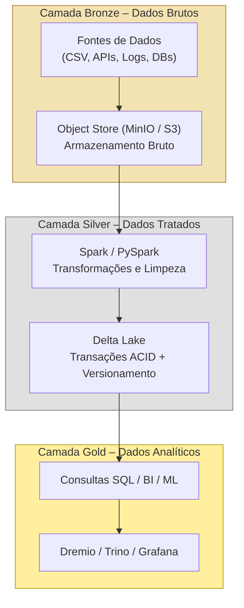
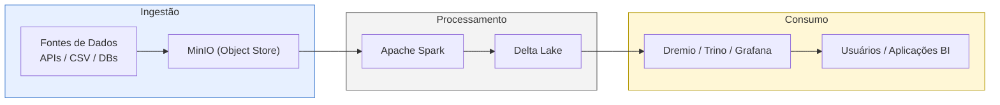

# Data Lakehouse: Estruturação Transacional sobre Object Stores

## 1. Visão Geral

O advento do conceito de Data Lakehouse trouxe à tona uma necessidade central: oferecer sobre os object stores as mesmas garantias de consistência, integridade e controle de esquema antes restritas aos Data Warehouses. Essa convergência entre flexibilidade e confiabilidade impulsionou o surgimento de três projetos de código aberto que se tornaram pilares dessa nova geração de arquiteturas de dados distribuídos: Delta Lake, Apache Hudi e Apache Iceberg.
Embora compartilhem o mesmo objetivo — adicionar transações ACID, versionamento e governança de esquema a dados armazenados em formatos colunares —, esses frameworks divergem em design, metadados, desempenho e integração com engines analíticas. Na prática, atuam como camadas transacionais sobre Data Lakes, garantindo consistência em operações de leitura e escrita em ambientes distribuídos e concorrentes. Essas soluções transformaram o paradigma dos Data Lakes, antes essencialmente imutáveis e sem garantias ACID, em repositórios confiáveis e auditáveis, aptos a servir tanto pipelines de ingestão em tempo real quanto consultas analíticas complexas e workloads de machine learning. A essência de um transactional Data Lake está na capacidade de aplicar sobre o armazenamento distribuído — geralmente um object store como S3, MinIO ou ADLS — uma camada lógica que ofereça:

- **Atomicidade (A)**: uma transação é aplicada integralmente ou revertida em caso de falha.
- **Consistência (C)**: o estado do dataset permanece válido e coerente após cada operação.
- **Isolamento (I)**: múltiplas operações concorrentes não se interferem mutuamente.
- **Durabilidade (D)**: uma vez confirmada, a transação persiste mesmo diante de falhas.

Além das garantias ACID, essas camadas adicionam mecanismos como *schema enforcement*, *schema evolution*, *time travel* e catálogos transacionais otimizados, permitindo navegar entre versões históricas de uma tabela, aplicar *merges* incrementais e integrar consultas de múltiplas *engines* de processamento. Para fornecer tais camadas, ferramentas como Delta Lake, Hudi e Iceberg podem ser vistas como camadas de metadados transacionais no ecossistema de Big Data, pois são capazes de controlar o acesso a dados físicos ao *object store*, convertendo diretórios de arquivos em tabelas transacionais versionadas.

O Spark e os sistemas de arquivos distribuídos, a exemplo do HDFS (Hadoop Distributed File System) e de object stores como o MinIO, nasceram para resolver problemas estruturais de desempenho e escalabilidade que as arquiteturas centralizadas já não suportavam. Essas plataformas foram concebidas para lidar com processamento massivo e distribuído de dados, explorando paralelismo e tolerância a falhas — ou seja, tratam da fundação da engenharia de dados. No ecossistema tradicional, havia uma separação clara entre sistemas OLTP (Online Transaction Processing) — bancos voltados a transações pequenas, rápidas e consistentes, como registros de sistemas corporativos — e OLAP (Online Analytical Processing), que agregam, consolidam e cruzam grandes volumes de dados históricos para suporte à decisão. Para alimentar os ambientes OLAP, eram utilizados processos ETL (Extract, Transform, Load), em que os dados eram extraídos dos sistemas de origem, transformados em um formato analítico e então carregados em um data warehouse. Com o avanço das arquiteturas distribuídas e o barateamento do armazenamento, surgiu a abordagem ELT (Extract, Load, Transform), invertendo a ordem: os dados são primeiro carregados no data lake bruto e depois transformados conforme a necessidade analítica.

Contudo, à medida que analistas e cientistas de dados passaram a usar o Spark e os data lakes para finalidades além da computação distribuída — tentando reproduzir comportamentos de governança, versionamento e consistência típicos do mundo OLAP — o uso se tornou caótico em muitos ambientes, visto que o ecossistema original não possuía suporte ao controle transacional (ACID), nem garantia de esquema, nem versionamento temporal ou catálogos de metadados consistentes. Para tratar essa fragmentação e devolver previsibilidade ao ambiente distribuído, surgiram as soluções de Data Lakehouse, como Delta Lake, Hudi e Iceberg. Elas padronizam transações, versionamento, schema evolution e catálogo de metadados, reconciliando o mundo da engenharia de dados (OLTP/ELT) com as demandas de governança e consistência do contexto analítico (OLAP/ETL).

## 2. Frameworks de Data Lakehouse e Arquitetura Medallion

Para organizar a evolução dos dados dentro desse ecossistema distribuído, surgiu o modelo Medallion, amplamente adotado em arquiteturas modernas de Data Lakehouse. Criado pela Databricks em meados de 2019, o modelo foi idealizado por Michael Armbrust e sua equipe como uma convenção arquitetural voltada à estruturação e à governança de dados em larga escala. Armbrust, pesquisador do AMP Lab da UC Berkeley, destacou-se desde 2008 por seus trabalhos em sistemas distribuídos e computação em nuvem, tendo contribuído para o desenvolvimento do Spark SQL e do Catalyst Optimizer, em conjunto com as pesquisas de Matei Zaharia e Ion Stoica — avanços que consolidaram o Apache Spark como principal motor analítico distribuído da última década.

A proposta do Medallion reflete essa trajetória. Ela transpõe para o contexto do armazenamento em nuvem as boas práticas de consistência, versionamento e governança que faltavam aos data lakes tradicionais. Dividido em três camadas — Bronze, Silver e Gold — o modelo estabelece uma progressão de qualidade e confiabilidade dos dados, do estágio bruto até o consumo analítico. Na camada Bronze, concentram-se os dados brutos, diretamente extraídos das fontes, preservando integridade e rastreabilidade. A camada Silver aplica processos de limpeza, normalização e padronização, transformando os dados em estruturas analíticas consistentes. Por fim, a camada Gold consolida dados agregados e otimizados, prontos para alimentar painéis, relatórios ou modelos de machine learning.
Do ponto de vista da engenharia de dados, o modelo Medallion não é apenas uma convenção organizacional, mas uma estratégia operacional de governança: separa responsabilidades, garante versionamento previsível e reduz o acoplamento entre ingestão, transformação e consumo. 




Em termos práticos, em nosso último laboratório já estruturamos a camada Bronze, responsável pela captura e armazenamento dos dados brutos sobre o object store. Essa camada garante rastreabilidade e preservação da integridade, mas ainda carece de um mecanismo transacional capaz de assegurar consistência entre múltiplos processos de leitura e escrita. À medida que evoluímos para as camadas Silver e Gold, torna-se indispensável introduzir um framework de armazenamento confiável, que ofereça transações ACID, controle de versionamento e gerenciamento de metadados — elementos fundamentais para um Data Lakehouse plenamente operacional. 

Entre as principais soluções que atendem a esses requisitos destacam-se o Delta Lake (Databricks), o Apache Hudi (Uber) e o Apache Iceberg (Netflix). Todos surgiram para suprir as limitações dos data lakes tradicionais, trazendo controle transacional e rastreabilidade sobre object stores. O Hudi prioriza a ingestão incremental e o atualização eficiente de registros, sendo amplamente usado em cenários de streaming analytics. O Iceberg, por sua vez, enfatiza a independência do catálogo de metadados e o suporte nativo a múltiplos motores de consulta, como Spark, Flink e Trino. Já o Delta Lake combina simplicidade operacional, profunda integração com o Spark e maturidade de ecossistema, o que o consolidou como a escolha predominante para a maior parte das arquiteturas modernas de Data Lakehouse.

### 2.1. Comparativo entre Frameworks de Lakehouse

| Aspecto | Delta Lake | Apache Hudi | Apache Iceberg |
|----------|--------------------------|--------------|----------------|
| **Origem** | Databricks | Uber | Netflix |
| **Padrão de metadados** | Arquivo `_delta_log` em JSON + Parquet | Timeline com commits incrementais | Manifest + Metadata JSON + Snapshot |
| **Transações ACID** | Sim (via log no storage) | Sim (timeline de commits) | Sim (snapshot atomic) |
| **Schema enforcement** | Sim | Sim | Sim |
| **Time Travel (versões antigas)** | Sim (por versão ou timestamp) | Sim (via instant) | Sim (via snapshot-id ou timestamp) |
| **Merge/Upsert nativo** | Sim (com `MERGE INTO`) | Sim (nativo e mais eficiente) | Parcial (dependendo do engine) |
| **Indexação interna** | Não (usa estatísticas do Parquet) | Sim (Bloom + Column stats) | Sim (Manifest pruning) |
| **Integração com Spark** | Altíssima (plugin nativo) | Alta | Alta |
| **Integração com Presto/Trino/Flink** | Boa | Muito boa | Excelente |
| **Modos de atualização suportados** | Batch e Streaming (unificado) | Batch e Streaming | Batch e Streaming |
| **Catálogo** | Hive Metastore, Glue, Unity Catalog | Hive Metastore | Nessie, Glue, Hive, REST |
| **Governança e compatibilidade** | Foco em Databricks | Foco em ingestão incremental | Foco em interoperabilidade aberta |
| **Ponto forte** | Estabilidade, maturidade e integração Spark | Ingestão contínua (CDC/Streaming) | Escalabilidade e governança multi-engine |
| **Licença** | Apache 2.0 (Linux Foundation) | Apache 2.0 | Apache 2.0 |

### 2.2. Quando Utilizar Cada Framework?

- **Delta Lake**: é a melhor escolha para ambientes onde o Spark é predominante e busca-se simplicidade e confiabilidade. Permite escrita direta com sintaxe simples: `df.write.format("delta").save("s3://bucket/bronze")`

- **Apache Hudi**: Projetado para ingestão contínua e operações de upsert (atualizações e inserções incrementais), é amplamente utilizado em pipelines near real-time. Oferece mecanismos de indexação, rollback e commit timeline eficientes, embora exija maior complexidade de configuração. Indicado para demonstrar integração incremental e merge de fluxos de dados em ambientes produtivos.

- **Apache Iceberg**: Voltado para governança e compatibilidade multi-engine, o Iceberg oferece escalabilidade superior em metadados e suporte nativo a Spark, Flink, Trino, Presto e Snowflake. É o padrão emergente de interoperabilidade aberta, adotado por grandes empresas como Netflix, Apple e AWS. Indicado para Lakehouse corporativo e interoperável.

Em suma, embora Hudi e Iceberg ofereçam vantagens específicas — ingestão incremental e interoperabilidade multi-engine, respectivamente —, o Delta Lake destaca-se pela maturidade do ecossistema e pela integração profunda ao Apache Spark, fatores decisivos para sua adoção em ambientes educacionais e corporativos.

## 3. Entendendo o Delta Lake

Mantido pela Linux Foundation e fortemente associado à Databricks, o Delta Lake foi o primeiro framework amplamente adotado a implementar transações ACID sobre object stores. Seu núcleo baseia-se em um log transacional, denominado `delta_log`, que registra de forma incremental todas as operações executadas em uma tabela. Esse log, composto por arquivos JSON (metadados de commits) e Parquet (snapshots otimizados), permite isolamento total entre sessões Spark, assegurando consistência e reprodutibilidade mesmo em ambientes distribuídos.

Em ambientes de dados dinâmicos, especialmente aqueles que recebem atualizações frequentes de diversas fontes, é comum a necessidade de combinar informações novas com registros já existentes. Tradicionalmente, isso exigiria duas operações distintas: INSERT, para adicionar novos dados, e UPDATE, para modificar os existentes. Para simplificar esse processo, surgiu o termo UPSERT — uma junção de UPDATE e INSERT — que designa uma operação capaz de atualizar o que já existe e inserir o que ainda não existe, de forma automatizada e atômica.

No Delta Lake, cada escrita ou atualização gera uma nova versão do log, o que viabiliza recursos como time travel, auditoria e recuperação de estados anteriores — características ausentes nos data lakes tradicionais. Essa funcionalidade é implementada por meio do comando MERGE INTO, que compara uma tabela de origem (source) com uma tabela de destino (target). Quando há correspondência entre os registros (por exemplo, mesmo identificador), o dado é atualizado; quando não há, é inserido. Essa operação é fundamental em pipelines incrementais ou de Change Data Capture (CDC), pois permite aplicar modificações contínuas — como inclusões, correções e atualizações — sem necessidade de reprocessar todo o conjunto de dados, mantendo a consistência e eficiência do ambiente.

Assim, ao combinar desempenho, governança e compatibilidade com o ecossistema Spark, o Delta Lake tornou-se a base conceitual e prática das arquiteturas Lakehouse modernas, oferecendo as seguintes funcionalidades:

- Transações ACID completas sobre object storage;
- Time Travel nativo via `versionAsOf` ou `timestampAsOf`;
- Schema enforcement e schema evolution controlados no próprio log;
- Compatibilidade total com Apache Spark e integração com Presto, Trino, Hive e Flink;
- Vacuum e checkpointing para otimização de metadados;
- Merge e Upsert nativos (`MERGE INTO`) — recurso essencial em pipelines CDC (Change Data Capture). 

A arquitetura do Delta Lake é fundamentada em um modelo de armazenamento transacional baseado em logs, projetado para oferecer consistência, isolamento e versionamento sobre object stores como S3, ADLS ou MinIO. Diferentemente dos data lakes convencionais, que armazenam apenas arquivos Parquet ou ORC sem metadados de controle, o Delta Lake adiciona uma camada de metadados transacionais, responsável por registrar cada modificação realizada na tabela. Essa camada transforma diretórios de arquivos em tabelas versionadas, permitindo reconstruir o estado dos dados em qualquer ponto no tempo. No nível físico, cada tabela Delta é composta por dois elementos principais:

- Arquivos de dados, geralmente em formato Parquet, que armazenam o conteúdo efetivo das linhas e colunas.
- Diretório _delta_log/, que contém o histórico transacional completo da tabela.

Dentro do diretório `_delta_log/`, cada operação de escrita (como `INSERT`, `UPDATE`, `DELETE` ou `MERGE`) gera um novo arquivo de log numerado sequencialmente, por exemplo:

```bash
00000000000000000010.json
00000000000000000011.json
```

Esses arquivos JSON descrevem de forma detalhada os commits, especificando quais arquivos de dados foram adicionados ou removidos, as alterações de esquema e os metadados associados à transação. Para otimizar o desempenho e reduzir o custo de leitura desses logs, o Delta Lake cria periodicamente checkpoints, armazenados em formato Parquet. Cada checkpoint consolida o estado cumulativo das operações até um determinado ponto, permitindo que o Spark recupere rapidamente a versão mais recente da tabela sem processar todos os commits anteriores. Esse mecanismo é fundamental para garantir eficiência e escalabilidade em ambientes com grandes volumes de dados e alta frequência de atualização. A partir desses componentes, o Delta Lake implementa as quatro propriedades ACID: 

- Atomicidade: cada transação é aplicada por completo ou revertida, nunca parcialmente.
- Consistência: o log assegura que o estado final da tabela obedeça às restrições de esquema e integridade.
- Isolamento: múltiplas sessões Spark podem ler e escrever simultaneamente sem interferência, graças ao controle de versões.
- Durabilidade: as alterações registradas no `_delta_log` permanecem persistentes mesmo após falhas ou reinicializações.

Outro pilar dessa arquitetura é o schema enforcement, que impede a gravação de dados com estrutura incompatível com o esquema declarado, e o schema evolution, que permite alterar o formato da tabela (por exemplo, adicionando novas colunas) de maneira controlada e registrada no log. Essas funcionalidades tornam o Delta Lake particularmente adequado a ambientes de dados corporativos, nos quais a rastreabilidade, a integridade e a governança de schema são requisitos essenciais.

O fluxo operacional do Delta Lake é regido pelo princípio de controle de versões imutáveis, em que cada operação de escrita cria uma nova versão da tabela, preservando o histórico completo de modificações. Em vez de sobrescrever dados, o sistema registra incrementalmente as alterações no diretório _delta_log/, garantindo que versões anteriores permaneçam acessíveis e reprodutíveis. Essa abordagem viabiliza o recurso de time travel, que permite consultar o estado exato de uma tabela em qualquer ponto no tempo, com base no número de versão (version number) ou no instante temporal (timestamp) da transação.
Quando uma operação de escrita é executada (como INSERT, UPDATE, DELETE ou MERGE INTO), o Spark realiza os seguintes passos:

- Criação dos arquivos de dados em formato Parquet, contendo os novos blocos de registros.
- Geração de um arquivo de log JSON no diretório _delta_log/, descrevendo os arquivos adicionados e removidos, além dos metadados de operação.
- Atualização do commit sequence number, que identifica a nova versão da tabela.
- Geração de checkpoint periódico (em Parquet), consolidando as mudanças para acelerar futuras leituras.

Durante consultas de leitura, o Spark identifica a versão mais recente (ou a solicitada via time travel), lê o checkpoint mais próximo e aplica os commits subsequentes até reconstruir o estado desejado. Esse processo ocorre de forma transparente para o usuário, mas garante que todas as leituras sejam determinísticas, consistentes e reproduzíveis, independentemente da concorrência de outras sessões. O time travel é acessado por meio de parâmetros específicos no momento da leitura. Por exemplo: 

```python
# Consulta uma tabela Delta pela versão
df = spark.read.format("delta").option("versionAsOf", 10).load("s3://datalake/sales")

# Consulta uma tabela Delta por data e hora específicas
df = spark.read.format("delta").option("timestampAsOf", "2025-10-27T10:00:00").load("s3://datalake/sales")
```

Essa capacidade é fundamental para auditoria, reprocessamento e validação de experimentos analíticos, pois permite reproduzir resultados históricos sem necessidade de manter múltiplas cópias físicas de dados. Além disso, ela possibilita a implementação de estratégias de rollback e depuração, bastando selecionar uma versão anterior do dataset para restaurar o estado consistente anterior a uma falha ou erro operacional.

Internamente, o Delta Lake garante isolamento entre sessões concorrentes através de um mecanismo de otimização de leitura e escrita (controle de concorrência otimista). Antes de confirmar uma transação, o sistema verifica se os arquivos Parquet que seriam modificados ainda estão válidos; caso tenham sido alterados por outro processo, a transação é abortada e reexecutada sobre o novo estado. Essa estratégia elimina bloqueios pesados (locks) e mantém alto desempenho mesmo em clusters distribuídos.

Por fim, o recurso de vacuum é utilizado para remoção periódica de arquivos obsoletos (antigas versões de dados e logs), evitando acúmulo excessivo de metadados e otimizando o desempenho de leitura. Essa limpeza, porém, respeita um intervalo de retenção configurável — normalmente 7 dias —, preservando as versões recentes para time travel e recuperação.

O Delta Lake não apenas controla transações e versões, mas também assegura a integridade estrutural dos dados por meio de dois mecanismos complementares: schema enforcement e schema evolution. Esses recursos são fundamentais para manter a coerência entre os arquivos armazenados no object store e o modelo lógico das tabelas, evitando erros silenciosos e garantindo a governança de dados em escala.
O schema enforcement atua como uma camada de validação automática que impede a gravação de dados incompatíveis com o esquema previamente definido. Em outras palavras, antes que uma operação de escrita seja confirmada, o Delta Lake verifica se a estrutura (colunas, tipos e restrições) do novo lote de dados é consistente com o esquema da tabela. Caso haja divergência — como uma coluna ausente, um tipo incorreto ou um campo adicional não declarado — a operação é bloqueada. Esse comportamento evita a introdução acidental de anomalias que, em sistemas distribuídos tradicionais, poderiam corromper análises ou gerar resultados inconsistentes.
Por exemplo:

```python
df.write.format("delta").mode("append").save("s3://datalake/sales")
```

Se o DataFrame contiver colunas diferentes da definição original da tabela sales, o Delta emitirá um erro de incompatibilidade de esquema, protegendo a integridade do conjunto de dados. Já o schema evolution complementa esse mecanismo ao permitir que mudanças estruturais legítimas sejam aplicadas de forma controlada. Quando habilitado, ele registra no delta_log a adição, remoção ou modificação de colunas, preservando o histórico completo dessas alterações. Isso possibilita a evolução gradual dos modelos de dados sem a necessidade de recriar tabelas, facilitando a adaptação a novas fontes e requisitos de negócio. A opção pode ser ativada explicitamente:

```python
df.write.option("mergeSchema", "true").format("delta").mode("append").save("s3://datalake/sales")
```

Esse comando autoriza o Delta Lake a mesclar o esquema do novo lote de dados com o existente, adicionando colunas ausentes e mantendo compatibilidade com as versões anteriores da tabela. 

Em ambientes distribuídos, onde múltiplas equipes e ferramentas acessam os mesmos conjuntos de dados, a governança de metadados torna-se elemento essencial. O Delta Lake foi projetado para integrar-se de maneira nativa a diferentes catálogos de metadados — estruturas responsáveis por gerenciar o ciclo de vida lógico das tabelas, suas permissões, esquemas, versões e políticas de acesso. Essa integração garante que o modelo Lakehouse mantenha consistência semântica e controle centralizado, independentemente do mecanismo de consulta utilizado. O catálogo mais comum em implementações baseadas em Apache Spark é o Hive Metastore, utilizado historicamente em ecossistemas Hadoop. Ele permite registrar tabelas Delta como entidades persistentes, permitindo consultas diretas via SQL e integração com ferramentas de visualização e BI. Por exemplo:

```sql
CREATE TABLE sales USING DELTA LOCATION 's3://datalake/sales';
```

Essa abordagem permite que o Spark, Trino ou Presto reconheçam automaticamente o conjunto de dados como uma tabela transacional, dispensando configuração manual de caminhos físicos. Além do Hive Metastore, o Delta Lake oferece integração completa com serviços de catálogo modernos, como o AWS Glue Data Catalog e o Unity Catalog, ambos projetados para ambientes multiusuário e governança corporativa.

- O AWS Glue atua como catálogo centralizado e compatível com vários motores analíticos (Athena, EMR, Spark), sendo amplamente usado em implementações sobre S3. Ele fornece metadados versionados e controle de acesso baseado em políticas IAM.
- Já o Unity Catalog, solução nativa da Databricks, amplia essa funcionalidade ao introduzir governança multinível (metastore, catálogo e schema) e controle de acesso unificado entre clusters, notebooks e ferramentas externas. O Unity Catalog também integra auditoria, lineage de dados e gerenciamento de credenciais, características cruciais para ambientes regulados ou com múltiplas equipes de engenharia e ciência de dados.

Esses catálogos não apenas descrevem a estrutura das tabelas, mas também garantem isolamento, versionamento e rastreabilidade operacional, atributos indispensáveis para conformidade com normas de proteção e privacidade de dados, como a LGPD e o GDPR. O Delta Lake, ao operar sobre esses catálogos, combina controle de metadados, segurança e consistência transacional, elevando o nível de governança de dados dentro da arquitetura Lakehouse.

## 4. Prática com Delta Lake

Com os fundamentos teóricos consolidados, esta seção aplica os conceitos estudados em ambiente laboratorial, demonstrando a criação e manipulação de tabelas Delta sobre um object store compatível. Antes de criar a primeira tabela Delta, é necessário garantir que o Spark conheça o Delta Lake package compatível com a versão instalada. No Jupyter hospedado no contêiner Spark, basta iniciar a sessão com PySpark já carregando o pacote `delta-spark` via parâmetro `.config("spark.jars.packages", ...)` Ao executar essa célula, o PySpark baixa automaticamente o pacote `delta-spark_2.12-3.2.0.jar` e suas dependências. No entanto, em ambientes modernos conteinerizados, o ideal é fazer o build novamente incluindo esse .jar já na montagem do Dockerfile, que podemos fazer posteriormente dessa forma: 

```bash
# Baixa o Delta Lake compatível com Spark 3.5.x
RUN wget -q --no-check-certificate \
    https://repo1.maven.org/maven2/io/delta/delta-spark_2.12/3.2.0/delta-spark_2.12-3.2.0.jar \
    -P /usr/local/spark/jars/
```

Dessa forma, o pacote já estará disponível no classpath padrão do Spark. Em seguida, no notebook, a sessão Spark pode ser iniciada sem a linha `.config("spark.jars.packages", ...)`. Para validar a instalação, execute: 

```python
from delta import configure_spark_with_delta_pip

print("Versão do Delta Lake:")
spark.sql("SELECT version()").show()
```

### 4.1. Leitura dos arquivos CSV (Bronze)

Nesta etapa, aplicaremos o **Delta Lake** sobre os dados brutos da **Fórmula 1**, já utilizados no laboratório anterior. O objetivo é **evoluir da camada Bronze para a camada Silver**, introduzindo **controle transacional e versionamento** sobre os arquivos armazenados no **MinIO**, consolidando o ambiente **Lakehouse**. Os arquivos CSV localizados em `/home/jovyan/data/` contêm entidades básicas da base pública **Ergast F1 Dataset**, representando corridas, pilotos, equipes e resultados.

| Arquivo | Conteúdo | Exemplo de colunas |
|----------|-----------|--------------------|
| `drivers.csv` | Cadastro de pilotos | `driverId`, `driverRef`, `forename`, `surname` |
| `constructors.csv` | Equipes e fabricantes | `constructorId`, `name`, `nationality` |
| `races.csv` | Corridas por temporada | `raceId`, `year`, `circuitId`, `name`, `date` |
| `circuits.csv` | Circuitos e países | `circuitId`, `name`, `location`, `country` |
| `results.csv` | Resultados das provas | `raceId`, `driverId`, `constructorId`, `position`, `points` |

Esses arquivos representam a **Camada Bronze** do Data Lake — o ponto de aterrissagem dos dados brutos **sem controle transacional**, onde o objetivo principal é preservar a **integridade e rastreabilidade** das informações extraídas diretamente da fonte. O primeiro passo consiste em ler os arquivos CSV e registrá-los como DataFrames Spark, permitindo consultas e transformações em memória: 

```python
drivers = spark.read.option("header", True).csv("/home/jovyan/data/drivers.csv")
constructors = spark.read.option("header", True).csv("/home/jovyan/data/constructors.csv")
races = spark.read.option("header", True).csv("/home/jovyan/data/races.csv")
circuits = spark.read.option("header", True).csv("/home/jovyan/data/circuits.csv")
results = spark.read.option("header", True).csv("/home/jovyan/data/results.csv")

print(f"Drivers: {drivers.count()} | Results: {results.count()}")
```

A partir desse ponto, os dados brutos estão carregados e prontos para integração. 

### 4.2.2. Transformação e Integração (Silver)

Nesta etapa, criaremos uma visão integrada dos resultados da temporada 2022, unindo informações de pilotos, equipes e circuitos. Essa operação representa o refinamento dos dados — característica essencial da camada Silver.

```python
drivers.createOrReplaceTempView("drivers")
constructors.createOrReplaceTempView("constructors")
races.createOrReplaceTempView("races")
circuits.createOrReplaceTempView("circuits")
results.createOrReplaceTempView("results")

query = """
SELECT 
    r.year,
    ra.name AS race_name,
    c.name AS circuit,
    d.forename || ' ' || d.surname AS driver,
    d.nationality AS driver_nationality,
    cs.name AS constructor,
    cs.nationality AS constructor_nationality,
    rs.position,
    rs.points
FROM results rs
JOIN races ra ON ra.raceId = rs.raceId
JOIN drivers d ON d.driverId = rs.driverId
JOIN constructors cs ON cs.constructorId = rs.constructorId
JOIN circuits c ON c.circuitId = ra.circuitId
WHERE ra.year = 2022
"""

f1_2022 = spark.sql(query)
f1_2022.show(5, truncate=False)
print(f"Total de registros: {f1_2022.count()}")
```

### 4.2.3. Escrita no Delta Lake (Silver)
Com o dataset consolidado, salvamos o resultado no formato Delta Lake, armazenando os arquivos tratados dentro do bucket datalake do MinIO.

```python
delta_path = "s3a://datalake/f1_2022_delta"

f1_2022.write.format("delta").mode("overwrite").save(delta_path)

print("Tabela Delta gravada com sucesso em s3a://datalake/f1_2022_delta")
```

Após a execução, verifique no MinIO (`http://localhost:9001`) o novo diretório criado, contendo:

- Arquivos `.parquet` (dados brutos);
- Diretório `_delta_log/` (metadados transacionais).

Essa estrutura confirma que a tabela foi convertida em formato Delta.

### 4.2.4. Leitura e Validação

Agora podemos ler a tabela Delta diretamente do MinIO, verificando seu conteúdo e propriedades.

```python

from delta.tables import DeltaTable

tabela_delta = DeltaTable.forPath(spark, delta_path)
df_delta = tabela_delta.toDF()

df_delta.show(5, truncate=False)
print(f"Linhas totais: {df_delta.count()}")
```

Também é possível consultar o histórico transacional (commits registrados no `_delta_log`):

```python
tabela_delta.history().show(truncate=False)
```

Esse histórico mostra as operações realizadas — por exemplo, a escrita inicial da tabela (WRITE) e versões subsequentes (UPDATE, MERGE etc.).

### 4.2.5. Consultas Analíticas (Gold)

Mesmo antes de introduzir ferramentas como o Dremio, que atuam na camada conceitual Gold, é possível realizar consultas SQL diretas no Spark, simulando-a.
Por exemplo, rankings de pilotos e construtores.

```python
df_delta.createOrReplaceTempView("f1_2022_delta")

spark.sql("""
SELECT driver, SUM(points) AS total_points
FROM f1_2022_delta
GROUP BY driver
ORDER BY total_points DESC
LIMIT 10
""").show()

spark.sql("""
SELECT constructor, SUM(points) AS total_points
FROM f1_2022_delta
GROUP BY constructor
ORDER BY total_points DESC
LIMIT 10
""").show()
```

Essas consultas exemplificam a etapa final do fluxo Bronze → Silver → Gold, em que os dados tratados e padronizados passam a servir diretamente às análises de negócio e à visualização de indicadores.



# 5. Conclusão

A adoção do Delta Lake como camada transacional sobre object stores representa o ponto de convergência entre os modelos de Data Lake e Data Warehouse, materializando a arquitetura Lakehouse. Ao incorporar controle de versão, isolamento transacional e evolução de esquema, o Delta transforma um repositório essencialmente estático em uma base dinâmica, confiável e auditável — capaz de sustentar pipelines analíticos e operacionais sob os mesmos princípios de atomicidade e durabilidade de bancos relacionais.

Os mecanismos de schema enforcement e schema evolution equilibram estabilidade e adaptabilidade, assegurando integridade estrutural sem comprometer a evolução natural dos modelos de dados. Já o log transacional (_delta_log/) e o time travel garantem reprodutibilidade e rastreabilidade, tornando o armazenamento distribuído temporalmente navegável — requisito essencial para auditoria, depuração e governança de dados.

Quando associado a catálogos de metadados corporativos, o Delta Lake amplia seu escopo técnico e assume papel estratégico, conectando armazenamento físico e controle lógico. Essa integração unifica acesso, segurança e versionamento sob uma mesma estrutura, consolidando o modelo Medallion — da ingestão bruta (Bronze), passando pelo refinamento e consistência (Silver), até a exploração analítica (Gold), etapa que será futuramente implementada com o Dremio.

Ao combinar desempenho distribuído, governança rigorosa e interoperabilidade, o Delta Lake consolida-se como o alicerce prático da arquitetura Data Lakehouse — uma infraestrutura unificada, resiliente e preparada para sustentar as demandas contemporâneas da engenharia e da inteligência analítica de dados.