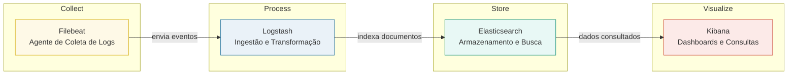

# Elastic Search (Stack ELK)

## 1. Visão Geral

O Elasticsearch é um banco de dados NoSQL orientado a documentos, baseado em JSON e otimizado para busca, agregação e análise de dados em tempo real. Sua arquitetura é distribuída, escalável e tolerante a falhas, permitindo armazenar e consultar grandes volumes de informações com baixa latência.

Cada registro é armazenado como um documento JSON dentro de um índice (conceito equivalente a uma tabela em bancos relacionais), mas com estrutura flexível (esquema dinâmico). As consultas são executadas sobre campos indexados por meio da engine de busca Lucene, que constrói um índice invertido, o que possibilita filtragem, ranking e agregações estatísticas de forma eficiente.

A pilha completa (Elastic Stack) combina três componentes principais:

| Componente        | Função                    | Descrição                                                                 |
|-------------------|---------------------------|---------------------------------------------------------------------------|
| **Elasticsearch** | Armazenamento e busca     | Banco de documentos JSON, com API REST e suporte a agregações complexas.  |
| **Logstash**      | Ingestão e transformação  | Pipeline de entrada, filtragem e envio de dados (input → filter → output).|
| **Kibana**        | Visualização e exploração | Interface web para consultas, dashboards e monitoramento de métricas.     |

Essa combinação permite criar pipelines completos de observabilidade, desde a coleta de logs brutos até a análise interativa em dashboards.  
A Stack também serve como base para módulos complementares, como **Filebeat, Metricbeat e APM Server**, ampliando a coleta para métricas e traces de aplicações distribuídas.

## 2. Arquitetura e Conceitos Chave 

Além SGBD de documentos (Elastic Search), temos a ferramenta Logstash, usada quando há necessidade de transformação complexa (ex: parsing avançado com Grok, enriquecimento de dados com lookups, normalização). Em fluxos mais simples, o Filebeat pode enviar os dados diretamente para o Elasticsearch, usando processadores de ingestão internos do ES para transformações leves. 



| Conceito | Descrição | Analogia (SQL) |
|-----------|------------|----------------|
| **Documento** | Unidade básica de informação, representada como um objeto JSON armazenado em um índice. | Linha / Registro |
| **Index** | Coleção de documentos que compartilham um propósito comum. | Banco de Dados / Tabela |
| **Shard** | Instância física do índice, menor unidade de escalabilidade e distribuição. | Partição de Tabela |
| **Replica** | Cópia redundante de um *shard*, usada para alta disponibilidade e tolerância a falhas. | Replicação de Banco |
| **Index Inverted** | Estrutura de dados que mapeia cada termo para os documentos onde ele aparece, permitindo busca rápida. | Índice de Tabela |

## 3. Descrição do Ambiente

Este ambiente permite compreender na prática:

- Como funciona o banco de documentos e índices invertidos.
- O fluxo de ingestão e transformação de dados.
- A estrutura e funcionamento de pipelines de observabilidade e monitoramento.

```bash
opt/elastic/
│
├── Dockerfile               # Adiciona ingest-attachment plugin (Apache Tika)
├── docker-compose.yml       # Stack principal: Elasticsearch, Logstash, Kibana
├── permissions.sh           # Script opcional de criação e ajuste de pastas
│
├── datasets/                # Logs e datasets de teste (ex: apache_access.log)
│
├── elastic/                 # Persistência do Elasticsearch (dados)
│   ├── config/
│   └── data/
│
└── logstash/
    └── pipelines/           # Definição dos pipelines (.conf)
```

### 3.1. Inicialização

```bash
cd /opt/elastic
docker compose up -d --build
```

Verifique se os containers estão ativos:

```bash
docker ps
```

### 3.2. Acesso às ferramentas

| Serviço        | URL / Porta              | Descrição                          |
|----------------|--------------------------|------------------------------------|
| **Elasticsearch** | [http://localhost:9200](http://localhost:9200) | API REST e armazenamento de índices |
| **Kibana**        | [http://localhost:5601](http://localhost:5601) | Interface de análise e dashboards |
| **Logstash**      | Porta 5044 / 9600       | Entrada de logs e API interna |

Baixe um dataset de logs de exemplo:

```bash
curl https://raw.githubusercontent.com/elastic/examples/master/Common%20Data%20Formats/apache_logs/apache_logs -o datasets/apache_access.log
```

Crie um pipeline em `logstash/pipelines/apache.conf`:

```bash
input {
  file {
    path => "/datasets/apache_access.log"
    start_position => "beginning"
    sincedb_path => "/dev/null"
  }
}
filter {
  grok {
    match => { "message" => "%{COMBINEDAPACHELOG}" }
  }
}
output {
  elasticsearch {
    hosts => ["http://elasticsearch:9200"]
    index => "apache-logs"
  }
  stdout { codec => rubydebug }
}
```

Reinicie apenas o Logstash:

```bash
docker compose restart logstash
```

Acompanhe os logs:

```bash
docker compose logs -f logstash
```

### 3.3. Verificação no Kibana

Acesse `http://localhost:5601`

Vá em `Discover → Create data view`

**Nome**: `apache-logs*`

Clique em `Create data view`

Os documentos devem aparecer automaticamente.

### 3.4. Extensões e ferramentas do ecossistema ELK

O **Filebeat** é um agente leve projetado para a coleta e o envio de logs. Ele pode ser adicionado ao ambiente sem qualquer modificação na stack principal, sendo ideal para testes de ingestão direta de dados. Atua como um *shipper*, ou seja, lê arquivos de log locais — como `/var/log/*.log`, registros de aplicações ou access logs de servidores — e encaminha os eventos coletados diretamente para o Elasticsearch ou, opcionalmente, para o Logstash, que pode realizar transformações adicionais. Entre suas principais vantagens está o consumo mínimo de recursos: tipicamente menos de 50 MB de memória e uso de CPU praticamente insignificante. Por essa razão, é amplamente utilizado em cenários onde se busca simplicidade, eficiência e baixo impacto sobre o sistema monitorado. Para utilizá-lo, crie um `filebeat.yml`: 

```yml
filebeat.inputs:
  - type: log
    enabled: true
    paths:
      - /datasets/apache_access.log

output.elasticsearch:
  hosts: ["http://elasticsearch:9200"]

setup.kibana:
  host: "http://kibana:5601"

logging.to_files: false
```
Adicionar serviço temporário e execute apenas quando quiser testar:

```bash
docker run -d --name filebeat \
  --user=root \
  --network=mybridge \
  -v ./datasets:/datasets \
  -v ./filebeat.yml:/usr/share/filebeat/filebeat.yml \
  docker.elastic.co/beats/filebeat:8.14.3
```

Verifique a saída:

```bash
docker logs -f filebeat
```

O índice `filebeat-*` aparecerá no `Kibana → Discover`.

Para remover:

```bash
docker rm -f filebeat
```

Por sua vez, o **Metricbeat** é uma agente voltado à coleta de métricas de sistema e aplicações. Mede CPU, memória, rede, I/O, e também integra com serviços como PostgreSQL, Nginx, Redis, etc. Assim, pode substituir o antigo `top + iostat + netstat` em ambientes distribuídos. Como saída, temos os índices `metricbeat-*` no Elasticsearch.Em observabilidade serve como fonte para dashboards de infraestrutura e aplicações no Kibana (SO Linux, NodeJS, Java, etc.).

Outra importante ferramenta é o **APM Server**, componente da Elastic para APM (Application Performance Monitoring). Recebe traces, métricas e spans de aplicações instrumentadas (Python, Java, Node, etc.) via agente. Captura latência, erros, tempo de resposta, dependências entre serviços. A integração é direta em `Kibana → Observability → APM`. Cria índices `apm-*` e `traces-*`.

O **Cerebro** é uma interface web para administração direta do Elasticsearch para visualizar índices, shards, cluster health, executar queries, alterar settings. Outra alternativa nesse sentido é o **ElasticHQ**, ferramenta similar ao Cerebro, que oferece visualização de cluster, índices e métricas, podendo rodar dentro do mesmo container da stack.


## 4. Conclusão

Com a Stack ELK, é possível criar uma solução completa de observabilidade, desde a coleta bruta de logs até a visualização analítica em tempo real.