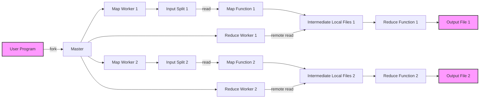

# Apache Hadoop

Apache Hadoop é um framework para processamento distribuído e armazenamento de grandes volumes de dados. Ele utiliza o modelo de programação MapReduce e um sistema de arquivos distribuídos chamado Hadoop Distributed File System (HDFS).

## Características

- **Processamento Distribuído**: Hadoop permite o processamento distribuído de grandes volumes de dados em clusters de computadores.
- **Hadoop Distributed File System (HDFS)**: HDFS é um sistema de arquivos distribuído que armazena dados em clusters de computadores.
- **Modelo de Programação MapReduce**: O modelo de programação MapReduce permite o processamento paralelo de dados.
- **Ecossistema Rico**: Hadoop possui um ecossistema rico, incluindo ferramentas como Apache Hive, Apache HBase, Apache Pig, e outros.

## Instalação via Docker Compose

A instalação do Apache Hadoop pode ser realizada através do Docker Compose. Siga os passos abaixo:

1. Crie um arquivo `docker-compose.yml` com o seguinte conteúdo:

```yaml
version: '3'

services:
  namenode:
    image: bde2020/hadoop-namenode:2.0.0-hadoop3.2.1-java8
    container_name: namenode
    volumes:
      - namenode:/hadoop/dfs/name
    environment:
      - CLUSTER_NAME=test
    ports:
      - "9870:9870"

  datanode:
    image: bde2020/hadoop-datanode:2.0.0-hadoop3.2.1-java8
    container_name: datanode
    volumes:
      - datanode:/hadoop/dfs/data
    environment:
      - SERVICE_PRECONDITION=namenode:9870
    depends_on:
      - namenode

  resourcemanager:
    image: bde2020/hadoop-resourcemanager:2.0.0-hadoop3.2.1-java8
    container_name: resourcemanager
    depends_on:
      - namenode
    ports:
      - "8088:8088"

  nodemanager:
    image: bde2020/hadoop-nodemanager:2.0.0-hadoop3.2.1-java8
    container_name: nodemanager
    environment:
      - SERVICE_PRECONDITION=resourcemanager:8088
    depends_on:
      - resourcemanager

  historyserver:
    image: bde2020/hadoop-historyserver:2.0.0-hadoop3.2.1-java8
    container_name: historyserver
    volumes:
      - historyserver:/hadoop/yarn/timeline
    depends_on:
      - resourcemanager

volumes:
  namenode:
  datanode:
  historyserver:
```

