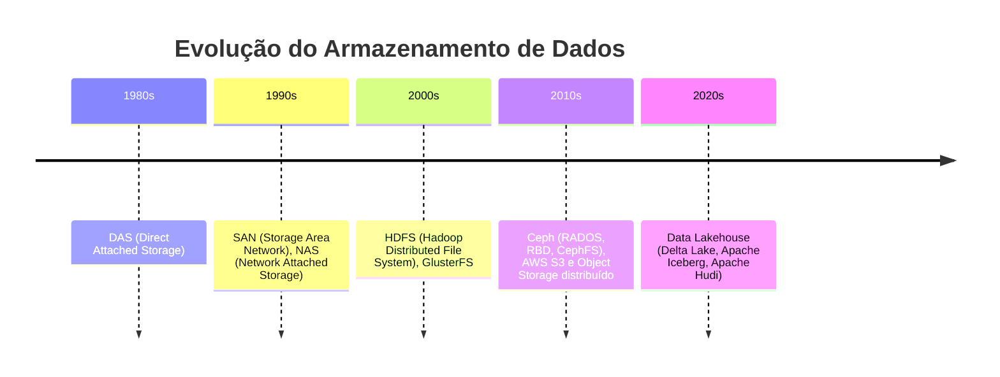

# Fundamentos de Armazenamento de Dados

## 1. Introdução

O crescimento do volume e da variedade de dados tornou inviável tratá-los como meros arquivos locais guardados em disco. A escolha da abordagem de armazenamento condiciona custo, desempenho, segurança e, sobretudo, capacidade de escala. No ecossistema de big data, consolidou-se a abordagem de armazenamento baseado em objeto. Este conceito materializa o acesso ao conteúdo via HTTP (API S3 e compatíveis, como AWS S3 e Azure Blob Storage), que sustenta data lakes e aplicações modernas de Big Data, Operações de AI/ML e BI/Analytics, tanto on-premises quanto em nuvem. Assim, cada item é um objeto identificado por um ID único, descrito por metadados e atributos, e portador de um conteúdo binário que representa dados não estruturados (imagens, vídeos, backups, logs). Projetado para arquiteturas distribuídas e para operações em larga escala, o armazenamento baseado em objeto emerge como resposta às limitações dos modelos anteriores. Antes de iniciar a prática, é essencial situar a evolução — do disco local e dos storages monolíticos para mecanismos que exigem particionamento e novos requisitos de acesso — e compreender por que a mudança ocorreu: requisitos de escalabilidade, governança e necessidade de desacoplamento do processamento e armazenamento. 

## 2. Linha do Tempo e Principais Desafios

Historicamente, aplicações gravavam dados em discos conectados ao próprio servidor. A proximidade reduzia latência e simplificava a operação. Em contrapartida, havia acoplamento forte: falhas do servidor interrompiam acesso; expansão exigia trocas físicas; a escala era limitada aos recursos computacionais e de armazenamento de um só computador. Para aumentar desempenho e tolerância a falhas, adotaram-se controladoras e RAID (conjuntos de discos atuando como uma unidade lógica). O RAID (Redundant Array of Independent Disks)  melhora paralelismo e pode sobreviver à perda de discos, mas o armazenamento continua localmente atachado ao servidor. Ou seja, condicionado a falhas no servidor e com restrições de expansão.

O passo seguinte foi movimentar os discos do servidor e centralizar em equipamento central dedicado, um storage em rede SAN (Storage Area Network). Assim, os servidores passam a “enxergar” volumes remotos para suas aplicações, e formatam neles seus sistemas de arquivos, e protocolos em nível de bloco (FCP, iSCSI), oferecendo alto desempenho e consolidação para bancos de dados e máquinas virtuais. Contudo, possui alguns limites claros para uma arquitetura monolítica: a escala predominantemente vertical, com custo e complexidade elevados e pontos de gargalo previsíveis.

Em paralelo, popularizou-se o NAS (Network Attached Storage), que oferece um modelo de compartilhamento de arquivos em hierarquia de pastas por protocolos de rede (SMB/CIFS no ecossistema Windows; NFS no ecossistema Linux). É excelente para colaboração e documentos. Contudo, metadados hierárquicos e atributos de segurança (permissionamento) tornam-se gargalo à medida que o número de arquivos cresce para ordens de milhares e milhões.

Para reduzir os silos tecnológicos, grandes fabricantes como EMC, Netapp, IBM, HPE, Hitachi, dentre outros, passaram a entregar SAN (bloco) e NAS (arquivo) no mesmo chassi de equipamentos “unificados”. Isso simplifica a gestão, mas não altera o modelo: continua-se a escalar, majoritariamente, subindo a mesma caixa; backups, replicações e janelas operacionais tornam-se onerosas conforme a base cresce.

Surge então a família de sistemas de armazenamento distribuído, concebida para espalhar dados por múltiplos nós em cluster e superar as limitações dos storages monolíticos. O caso mais influente no contexto de Big Data foi o HDFS (Hadoop Distributed File System), projetado como fundação do ecossistema Hadoop. Nele, cada arquivo é dividido em blocos de grande porte (tipicamente 128–256 MB) e distribuído entre os DataNodes, enquanto os metadados (nome, localização e mapeamento de blocos) são centralizados em um NameNode. Essa estratégia foi concebida para otimizar leituras sequenciais em lote, características centrais do processamento massivo em MapReduce. Contudo, o HDFS apresenta limitações: arquivos pequenos geram sobrecarga no gerenciamento de metadados, e o acoplamento estreito ao ecossistema Hadoop restringe sua flexibilidade em cenários modernos.

Paralelamente, fora do Hadoop, emergiram soluções como o GlusterFS, que buscava entregar um sistema de arquivos distribuído compatível com POSIX (Portable Operating System Interface), garantindo interoperabilidade com sistemas UNIX/Linux. O GlusterFS distribui dados em múltiplos nós via agregação de volumes, sendo atraente em ambientes que precisavam de um “filesystem global”. Entretanto, também sofria com sensibilidade a arquivos pequenos e gargalos em operações de metadados.

Na sequência, destaca-se o Ceph, um dos sistemas distribuídos mais robustos, projetado sob a arquitetura de Object Storage Devices (OSDs). O Ceph fornece uma tríade de interfaces: RADOS (object storage nativo), CephFS (POSIX file system distribuído) e RBD (block device), permitindo unificação de bloco, arquivo e objeto em uma mesma plataforma distribuída e escalável (scale-out). Sua resiliência decorre do uso do algoritmo CRUSH, que elimina a necessidade de um servidor central de metadados para mapear onde os objetos estão, distribuindo de forma determinística os dados entre os nós. Essa abordagem tornou o Ceph referência em ambientes de nuvem privada (ex.: OpenStack) e clusters científicos, aproximando-se mais do paradigma atual de object storage voltado a Data Lakes.



### Comparação: HDFS vs Object Storage

| Critério        | HDFS (Hadoop)                              | Object Storage (S3/MinIO)                           |
|-----------------|---------------------------------------------|-----------------------------------------------------|
| Modelo de acesso| File System distribuído (POSIX-like)        | API HTTP/REST (S3, compatível com nuvem)            |
| Unidade de dados| Arquivo dividido em blocos (128–256 MB)     | Objeto (conteúdo + ID + metadados + atributos)      |
| Otimização      | Leituras sequenciais em lote (batch)        | Acesso direto, paralelo e massivo via HTTP          |
| Integração      | Ecossistema Hadoop / MapReduce              | Spark, Flink, Airflow, AI/ML frameworks             |
| Limitações      | Sobrecarga para arquivos pequenos, acoplado | Sem hierarquia, mas escalável e cloud-native        |

Essas soluções pavimentaram a transição para o armazenamento de objetos exposto via HTTP e APIs RESTful (como S3), que abandonam de vez as interfaces POSIX tradicionais para priorizar escalabilidade, simplicidade de endereçamento e integração direta com aplicações distribuídas.

## 3. Modelos de Armazenamento

Como vimos na seção anterior, ao longo da evolução das arquiteturas de TI, consolidaram-se três modelos fundamentais de armazenamento, cada qual com características próprias de desempenho, escalabilidade e adequação às cargas de trabalho. 

- **Armazenamento de Bloco**: Baseado em soluções locais ou em redes de armazenamento dedicadas (SAN, via protocolos como iSCSI ou Fibre Channel). Os dados são organizados em blocos de tamanho fixo, e cabe ao sistema operacional do servidor formatar o volume em sistemas de arquivos (ext4, NTFS etc.). É a base de bancos de dados transacionais e hipervisores, em que latência mínima e alto IOPS são cruciais. Um volume de bloco não possui noção de arquivos, apenas de endereços lógicos; portanto, não há arbitragem nativa de concorrência. Para evitar corrupção quando múltiplos hosts acessam o mesmo volume, recorre-se a mecanismos como LUNs dedicadas a um único servidor, sistemas de arquivos com suporte a múltiplos hosts e bloqueio distribuído (ex.: VMFS), ou ainda protocolos de coordenação de baixo nível (SCSI-3) e multipath (ALUA/MPIO) para redundância de acesso. A governança (retenção, versionamento) é externa ao dispositivo lógico. Embora eficiente para dados estruturados, é pouco adequado a volumes massivos de dados não estruturados.

- **Armazenamento de Arquivos**: Oferecido por servidores ou appliances especializados (NAS – Network Attached Storage), que expõem hierarquias de diretórios via rede utilizando protocolos como NFS (Unix/Linux) e SMB/CIFS (Windows). A coordenação do acesso concorrente é feita pelo próprio servidor, que enxerga seus volumes em nível de bloco e os disponibiliza em forma de arquivos. Essa abordagem favorece colaboração e compartilhamento, mas sofre limitações de desempenho quando o número de arquivos ou operações de metadados (criação, listagem, renomeação) cresce para milhões. Em cargas analíticas modernas, a estrutura hierárquica e a pressão em metadados reduzem a eficiência em comparação ao armazenamento de objetos. Por isso, em Big Data, prevalecem formatos colunares otimizados para leitura analítica massiva.

- **Armazenamento de Objetos**: Evolução natural para lidar com a explosão de dados não estruturados. Cada item é tratado como objeto independente, composto por identificador único (ID), atributos e metadados enriquecíveis, além do conteúdo binário. Ao invés de expor sistemas de arquivos ou volumes, os objetos residem em repositórios acessíveis por APIs (ex.: REST, S3), eliminando a hierarquia tradicional de diretórios. Essa simplicidade de endereçamento (buckets com chave única) favorece escalabilidade horizontal massiva, interoperabilidade entre plataformas e governança granular (retenção, imutabilidade). Por isso, tornou-se a base tecnológica de Data Lakes e do ecossistema moderno de Big Data, AI/ML, Analytics e aplicações cloud-native.
## Tabela — Block vs File vs Object

| Critério   | Bloco (SAN/iSCSI)       | Arquivo (NFS/SMB)         | Objeto (S3/MinIO)                     |
|------------|-------------------------|---------------------------|---------------------------------------|
| Estrutura  | Blocos fixos            | Hierarquia de pastas      | Objeto + metadados + ID               |
| Acesso     | Driver/FS local         | FS de rede                | HTTP/REST (S3)                        |
| Uso típico | DB/VM alta IOPS         | Colaboração simples       | Data Lake / ML / Backup / Logs        |
| Escala     | Limitada                | Limitada                  | Scale-out elástico                    |

### Principais Vantagens e Características

- **Escalabilidade**: Graças ao uso de um espaço de endereçamento simples (Single Namespace), o armazenamento de objetos pode gerenciar vastas quantidades de dados sem comprometer o desempenho. Tanto a infraestrutura de armazenamento quanto os nós OSD (Object Storage Devices) podem ser escalados conforme necessário, garantindo uma solução flexível e eficiente.

- **Segurança e Confiabilidade**: Cada objeto é identificado por um ID exclusivo, gerado por um algoritmo especializado. Esse processo assegura a integridade e autenticidade dos dados, tornando-o bastante seguro, especialmente para dados críticos.

- **Independência de Plataforma**: Objetos podem ser acessados e compartilhados em diferentes plataformas e sistemas operacionais, tornando-os ideais para ambientes de computação em nuvem, onde múltiplos usuários ou sistemas precisam de acesso simultâneo aos dados.

- **Gerenciamento Inteligente**: Inclui funcionalidades automáticas de gerenciamento, como auto-recuperação de dados e políticas que garantem a retenção adequada dos objetos. Isso reduz a necessidade de intervenção manual e assegura a disponibilidade dos dados.

- **Políticas de Retenção e Imutabilidade**: Objetos podem ser configurados para se tornarem imutáveis após a gravação, garantindo a integridade e a preservação dos dados ao longo do tempo. Com o uso de políticas de conformidade (compliance), é possível definir períodos específicos de retenção, durante os quais os dados não podem ser alterados ou excluídos, assegurando que permaneçam intactos conforme originalmente gravados. O recurso **WORM** (Write Once, Read Many) reforça essa imutabilidade, permitindo que os objetos sejam gravados uma única vez e lidos quantas vezes forem necessárias, até o fim do período de retenção estabelecido.

## 4. Como Funciona?

O armazenamento de objetos elimina a complexidade da hierarquia de diretórios, usando um espaço de endereçamento simples (Single Namespace). Um objeto contém os dados do usuário, seus metadados (como tamanho, data e permissões), e um ID de objeto exclusivo, gerado por uma função de hash que garante sua unicidade. Isso permite que os dados sejam distribuídos de forma eficiente e recuperados de maneira rápida e segura dos OSDs, desde que você possua o ID em questão e as devidas permissões de acesso.

- **Upload**: Quando um aplicativo envia um arquivo para o sistema OSD, o arquivo é dividido em dados do usuário e metadados.
- **Geração de ID**: O sistema OSD gera um ID de objeto exclusivo com base nos dados do arquivo.
- **Armazenamento**: Os metadados e o ID do objeto são armazenados no servidor de metadados, enquanto os dados do usuário (o próprio objeto) são armazenados no dispositivo de armazenamento.
- **Confirmação**: O sistema confirma que o objeto foi armazenado com sucesso e envia uma resposta ao aplicativo, que pode guardar o ID em um banco relacional ou não relacional para posterior solicitação/recuperação.
- **Solicitação**: O aplicativo solicita um arquivo pelo seu ID de objeto.
- **Busca de Metadados**: O sistema recupera o ID do objeto através do servidor de metadados.
- **Recuperação do Objeto**: O ID do objeto é usado para recuperar os dados armazenados, que são então enviados de volta ao aplicativo.

### Principais Casos de Uso

O armazenamento de objetos elimina a complexidade da hierarquia de diretórios típica dos sistemas de arquivos, utilizando um espaço de endereçamento plano (Single Namespace). Cada entidade armazenada é um objeto, composto por quatro elementos essenciais:

- **ID Único**: identificador exclusivo (gerado, em geral, por função de hash) que garante unicidade e permite acesso direto ao objeto.

- **Metadados**: informações técnicas (tamanho, data de criação, permissões) e descritivas, que podem ser enriquecidas de acordo com a aplicação.

- **Atributos**: parâmetros de governança (ex.: política de retenção, imutabilidade, criptografia).

- **Conteúdo**: os dados binários (BLOB) em si (ex.: uma imagem, vídeo, documento ou log).

Esse modelo abstrai a noção de diretórios e organiza os objetos em buckets, estruturas lógicas de armazenamento que facilitam o particionamento e a escalabilidade horizontal.

### Ciclo de Operações

- **Upload**: O cliente envia um arquivo; o sistema divide dados de usuário e metadados.

- **Geração de ID**: É atribuído um identificador exclusivo, que funcionará como chave de acesso.

- **Armazenamento**: Metadados e ID ficam em servidores de metadados; o conteúdo binário é persistido nos OSDs (Object Storage Devices).

- **Confirmação**: O sistema retorna ao cliente o ID ou a URL do objeto.

- **Recuperação**: Quando solicitado, o sistema consulta o ID no servidor de metadados, localiza o objeto e o devolve ao cliente pela API.

Essa lógica simples permite escalar para bilhões de objetos sem degradação acentuada de desempenho.

### Principais Casos de Uso

- **Armazenamento em Nuvem**: Base de serviços como AWS S3, Azure Blob e Google Cloud Storage, acessados via APIs REST ou SOAP, garantindo interoperabilidade entre plataformas.

- **Arquivamento de Conteúdo**: Soluções CAS (Content Addressable Storage) asseguram retenção imutável para dados regulatórios, registros médicos ou logs financeiros.

- **Metadados Enriquecidos**: Possibilidade de incluir descrições, etiquetas ou atributos adicionais, facilitando busca e governança.

- **Endereçamento via URL**: Cada objeto pode ser acessado diretamente por um endereço único, o que simplifica integração em sistemas distribuídos.

### Papel no Ecossistema Big Data

O armazenamento de objetos tornou-se elemento central em arquiteturas de Data Lake, permitindo retenção e acesso eficiente a grandes volumes de dados heterogêneos. Ele serve como fundação para pipelines modernos, integrando-se a ferramentas como:

- Apache Kafka: ingestão de dados em tempo real (streams).
- Apache Spark: processamento distribuído em larga escala (ETL, análise, ML).
- Apache Airflow: orquestração e automação de pipelines.
- MinIO: alternativa on-premises e compatível com S3 para provisionar repositórios escaláveis de objetos.

No estágio mais avançado, Data Lakes modernos incorporam Delta Lake, Iceberg, Hudi e query engines como Trino e Presto.

- Delta Lake / Apache Iceberg / Apache Hudi – camadas de gerenciamento sobre object storage, trazendo ACID, versionamento e esquema evolutivo (fundamentais para Data Lakes confiáveis).
- Trino (antigo PrestoSQL) – query engine distribuído para consultar dados diretamente no object storage via SQL, sem mover dados.
- Hive / Impala – no legado Hadoop, mas ainda úteis para mostrar a ponte entre HDFS e object storage.
- Flink – alternativa ao Spark para processamento de streams com baixa latência.

## 5. Prática com MinIO

**MinIO** é uma solução de armazenamento de objetos de alto desempenho, totalmente compatível com a API do Amazon S3 (Simple Storage Service), serviço de nuvem amplamente usado no mercado. O MinIO foi projetado para armazenar e recuperar qualquer quantidade de dados em larga escala, podendo ser executado tanto em nuvem quanto em ambientes on-premises, inclusive em cenários de produção. Antes de partir para os comandos, é importante compreender o propósito da atividade: estamos definindo uma infraestrutura que reproduz os mesmos padrões de API adotados pelo S3, mas em ambiente controlado e sem custo. Isso permite aprender e praticar os fundamentos do armazenamento de objetos de forma realista, utilizando uma ferramenta que também é empregada em produção em Data Lakes corporativos. Atualmente, boa parte dos pipelines modernos de Big Data, Analytics, AI/ML ou BI começam carregando ou salvando dados em object storage acessado via HTTP, de modo que estará exercitando os mesmos fluxos de trabalho utilizados em infraestruturas reais de nuvem pública e híbrida e desenvolvendo habilidades diretamente aplicáveis ao mercado.

### Benefícios do MinIO

- **Compatibilidade com S3**: Totalmente compatível com a API S3 da AWS.
- **Alto Desempenho**: Ideal para workloads intensivos em dados.
- **Facilidade de Uso**: Interface web intuitiva e fácil configuração.
- **Segurança**: Suporte para criptografia em repouso e em trânsito.

### Operações Comuns

- **PUT**: Adicionar ou substituir um objeto em um bucket.
- **GET**: Recuperar um objeto de um bucket.
- **DELETE**: Remover um objeto de um bucket.
- **LIST**: Listar objetos em um bucket.

### Configuração

O container executará o serviço principal do MinIO, expondo:

- Porta 9000 – API S3 (para integração via bibliotecas, Python/Boto3, mc, curl etc.);
- Porta 9001 – Console Web (GUI de administração e navegação nos buckets).

Para iniciar o servidor MinIO no ambiente de prática, utilizaremos o Docker Compose, conforme o padrão estabelecido no projeto:

```bash
cd /opt/idp-bigdata/minio
docker-compose up -d
```

A aplicação está disponível na porta `9000` (API compatível com S3 em `http://localhost:9000`) e na porta `9001` (console administrativo via navegador em `http://localhost:9001`).
 
**Usuário:** minioadmin
**Senha:** minioadmin

Conforme já explicado em sala de aula, um ponto essencial é a persistência dos volumes: ao mapearmos diretórios locais do host para dentro do container, garantimos que os dados armazenados sobrevivam a reinícios ou recriações do container. Essa prática é fundamental para simular o comportamento de um serviço de armazenamento durável em produção e permite testar estratégias de backup e recuperação de dados. Além disso, o serviço MinIO será configurado na mesma rede lógica utilizada pelas demais aplicações do ambiente de prática (ex.: Jupyter Notebook ou outras ferramentas de análise). Isso assegura que os pipelines e notebooks possam acessar diretamente o storage, reproduzindo o cenário real de integração entre camada de dados e camada de processamento em arquiteturas de Big Data. Verifique o arquivo `docker-compose.yml` e promova os ajustes, para fixar este conhecimento. Acione o Professor em caso de dúvidas. 

### Terminologia

- **Objetos**: Unidades de dados/itens que são armazenadas nos buckets. Cada objeto dentro de um bucket é identificado por uma chave única, que funciona como o caminho completo para o arquivo, similar a um nome de arquivo em um sistema de arquivos tradicional. O controle de acesso baseia-se em usuários, grupos, políticas granulares e ACLs/IAM, permitindo restringir quem pode ler, gravar ou apagar objetos — algo essencial em pipelines de Big Data e Data Lakes com múltiplos times e diferentes regras de confidencialidade e uso. 
- **Buckets**: Um bucket não é apenas uma pasta ou diretório, mas um espaço de nomes (namespace) global. Dentro dele, cada objeto tem uma chave única, que funciona como identificador absoluto. Diferente da hierarquia de diretórios (árvore), no S3/MinIO não há “subpastas reais”: a separação por `/` é apenas parte do nome da chave. 
- **Chaves**: Identificadores únicos para cada objeto dentro de um bucket. 
- **Metadados e Atributos**: Informações adicionais armazenadas com cada objeto. Isso permite que o armazenamento de objetos seja mais do que um “repositório de bits”: ele pode organizar e classificar os dados de acordo com a lógica da aplicação ou da empresa, enriquecendo sua governança (ex: content-type, owner, classification): 

| Campo      | Valor                                                                                     |
|------------|-------------------------------------------------------------------------------------------|
| Objeto     | contrato123.pdf                                                                           |
| Metadados  | {`"owner":"juridico", "classification":"confidencial", "content-type":"application/pdf"`} |


### API Python: Boto3

O MinIO utiliza uma API compatível com S3 para realizar operações via chamadas HTTP, como upload, download, criação de buckets e listagem de arquivos, de forma semelhante à AWS. Para usar o MinIO com Python, a biblioteca recomendada é o Boto3, que facilita a comunicação com o servidor MinIO. O nome "Boto" faz referência ao boto-cor-de-rosa, um golfinho da Amazônia, escolhido de forma divertida por Mitch Garnaat, criador da biblioteca, comparando-a ao boto navegando pelos serviços da nuvem. Você pode instalar a Boto3 usando o `pip` ou configurando o Dockerfile da IDE Jupyter, como vimos em sala de aula.   

```python
pip install boto3
```
### Definição do Client

```python
import boto3
from botocore.client import Config

s3 = boto3.client(
    's3',
    endpoint_url='http://localhost:9000',
    aws_access_key_id='minioadmin',
    aws_secret_access_key='minioadmin',
    config=Config(signature_version='s3v4'),
    region_name='us-east-1'
)
```

### Criando um Bucket

No console, crie um bucket chamado meuprimeirobucket. Essa etapa simula o início da construção de um Data Lake: um espaço de endereçamento único para objetos. Em seguida, realize um upload simples (ex.: crie um arquivo `teste.txt`). Observe como o MinIO automaticamente associa ID, metadados e conteúdo ao objeto, diferentemente de um sistema de arquivos tradicional. A criação também pode ser feita via API: 

```python
# Exemplo de criação de um bucket
s3.create_bucket(Bucket='meu-novo-bucket')
```

### Exemplo de Gravação (PUT)

```python
# Gravar um arquivo (substitua pelo nome do seu bucket e objeto)
s3.upload_file('localfile.txt', 'meu-bucket', 'localfile.txt')
```

### Exemplo de Leitura (GET)

```python
# Ler um arquivo (substitua pelo nome do seu bucket e objeto)
s3.download_file('meu-bucket', 'localfile.txt', 'baixado_localfile.txt')
```

### Testando com curl

Em sua máquina, faça uma requisição ao objeto via terminal: 

```bash
# Exemplo de download usando a API S3 (substitua pelo nome do seu bucket e objeto)
curl -O http://localhost:9000/meuprimeirobucket/teste.txt \
     -u minioadmin:minioadmin
```

### Listando Objetos em um Bucket

```python

response = s3.list_objects_v2(Bucket='meu-bucket')
for obj in response.get('Contents', []):
    print(obj['Key'])
```

### Deletando um Objeto

```python
s3.delete_object(Bucket='meu-bucket', Key='localfile.txt')
```

### Gerando Presigned URLs com Python

Uma Presigned URL é um link temporário e autenticado que dá acesso direto a um objeto em um bucket, sem expor credenciais; isso é útil em Big Data e Cloud porque permite compartilhar dados de forma segura e controlada entre sistemas, pipelines e usuários, evitando cópias desnecessárias e reduzindo custos de transferência e gerenciamento de permissões. Após configurar o cliente `boto3` como visto antes, basta usar `generate_presigned_url` para criar o link. 

```python
import boto3
from botocore.client import Config

s3 = boto3.client(
    's3',
    endpoint_url='http://localhost:9000',
    aws_access_key_id='minioadmin',
    aws_secret_access_key='minioadmin',
    config=Config(signature_version='s3v4'),
    region_name='us-east-1'
)

# Gerar URL temporária para download
url = s3.generate_presigned_url(
    'get_object',
    Params={'Bucket': 'meu-novo-bucket', 'Key': 'localfile.txt'},
    ExpiresIn=3600  # segundos (1h)
)

print("URL temporária:", url)
```

### MinIO Client

O `mc` é o utilitário de linha de comando do MinIO. Ele é análogo ao AWS CLI, mas funciona com qualquer serviço compatível com a API S3, incluindo Azure BLOB Storage, Google Cloud Storage e o próprio MinIO. Na VM, baixe com o comando abaixo: 

```bash
wget https://dl.min.io/client/mc/release/linux-amd64/mc
chmod +x mc
sudo mv mc /usr/local/bin/
```

<!--# MacOS
brew install minio/stable/mc--> 

O primeiro passo é configurar uma conexão para seu servidor MinIO local, por meio de um alias: 

```bash
mc alias set local http://localhost:9000 minioadmin minioadmin
```

Depois você pode realizar as operações básicas: 

```bash
#Listar buckets:
mc ls local

#Criar bucket:
mc mb local/meu-bucket

#Upload de arquivo:
mc cp dados.csv local/meu-bucket/

#Download de arquivo:
mc cp local/meu-bucket/dados.csv .

#Listar objetos de um bucket:
mc ls local/meu-bucket

#Presigned URL
mc alias set local http://localhost:9000 minioadmin minioadmin
mc presign local/meu-bucket/dados.csv --expire 2h

# Simular IAM, criando usuários e políticas de acesso
mc admin user add local aluno123 senha123
mc admin policy attach local readwrite --user aluno123
```

## 6. Conclusão

O armazenamento baseado em objetos é uma solução robusta e versátil para gerenciar o crescimento exponencial de dados não estruturados. Com segurança, escalabilidade e flexibilidade, ele é ideal para aplicações modernas, como serviços de nuvem, arquivamento de longo prazo e gerenciamento de dados críticos.

Nesse contexto, o MinIO, compatível com a API S3, tem se destacado como uma solução eficiente e escalável, sendo amplamente adotado em ambientes on-premises e híbridos para criar datalakes que suportam ecossistemas de big data, facilitando o armazenamento, acesso e processamento de dados massivos.

Recomenda-se explorar o MinIO para testar essas funcionalidades em um ambiente controlado antes de migrar para soluções externas, como o Amazon S3. Esse método ajuda a validar fluxos de trabalho e garante desde o começo de seus projetos uma infraestrutura escalável e eficiente, numa arquitetura cloud-native. Para mais informações, consulte a documentação oficial do [MinIO](https://min.io/docs/).
