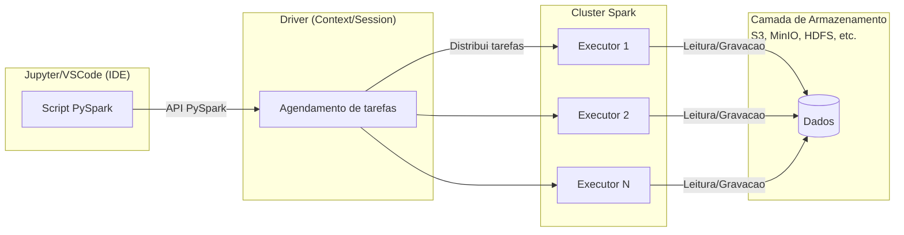

# Apache Spark

## 1. Introdução

O Apache Spark é um sistema de código aberto para computação distribuída em memória, agnóstico ao sistema de armazenamento subjacente, e projetado para executar processamentos paralelos e escaláveis sobre grandes volumes de dados. Ao longo dos anos, consolidou-se como a principal plataforma para processamento distribuído de dados massivos, superando algumas das limitações do modelo MapReduce para sustentar workloads de lote (batch), fluxos contínuos (streaming), consultas SQL, aprendizado de máquina (MLlib) e análise de grafos (GraphX) — tudo em um mesmo framework, ao contrário da abordagem fragmentada do ecossistema Hadoop, que tradicionalmente dependia da integração entre múltiplas ferramentas complementares, como Hive, Pig, Oozie e Mahout. Assim, ele funciona como infraestrutura unificada de processamento em larga escala, combinando pipelines de dados, machine learning e SQL sob uma arquitetura resiliente e extensível para aplicações que demandam alta desempenho, tolerância a falhas e execução distribuída em clusters locais ou em nuvem.

O projeto nasceu em 2009 no AMP Lab (Algorithms, Machines, and People Laboratory) da Universidade da Califórnia, Berkeley, sob liderança de Matei Zaharia, então pesquisador do laboratório e hoje CTO da Databricks. O Spark foi concebido como uma alternativa ao modelo MapReduce do Hadoop, oferecendo maior velocidade e flexibilidade no processamento de dados distribuídos. Seu desempenho expressivo e rápida adoção pela comunidade open-source levaram-no a tornar-se projeto de nível superior na Apache Software Foundation em 2014. Nesse mesmo ano, surgiu a Databricks, fundada por Zaharia, Ali Ghodsi, Ion Stoica e outros pesquisadores do AMP Lab, como um spinoff acadêmico com a missão de tornar o Spark acessível e operacional em escala empresarial.

Para isso, a empresa desenvolveu uma estratégia de entrega do Spark via SaaS (Software as a Service), fornecendo uma abstração baseada em nuvem — sem exigir que os usuários configurem/administrem a infraestrutura de clusters, armazenamento ou execução distribuída. Enquanto soluções como Cloudera e Hortonworks apostavam em distribuições do ecossistema Hadoop on-premises, mais complexas e que exigiam manutenção especializada, a Databricks foi pioneira em adotar um modelo cloud-native e multi-cloud, oferecendo Spark e outras ferramentas como serviços de catálogo (marketplace), devidamente integrados aos principais provedores do mercado: AWS, Microsoft Azure, Google Cloud e Alibaba Cloud. Essa estratégia se tornou atrativa para empresas que buscavam evitar custos de administração da infraestrutura, dimensionamento e otimização de recursos como NameNodes e JobTrackers.

A adoção do modelo SaaS pela Databricks não apenas simplificou o uso corporativo do Spark, mas também redefiniu a forma como os dados são processados e armazenados em ambientes distribuídos. Ao desacoplar completamente o motor de processamento da camada de armazenamento, os Data Lakes se tornaram estruturas mais dinâmicas para ingestão, processamento e análise, superando o papel puramente de repositório que exerciam até então. Desse avanço, emergiu o conceito de Data Lakehouse, termo cunhado pela própria Databricks, cuja proposta é combinar a flexibilidade e escala dos Data Lakes com as garantias transacionais e estruturais dos Data Warehouses. Essa abordagem unifica ingestão, governança e consulta sob um mesmo modelo arquitetural, reduzindo a fragmentação entre os sistemas de armazenamento bruto e os ferramentas analíticas.

## 2. Visão Geral da Arquitetura

O Apache Spark foi projetado para oferecer processamento distribuído de alta performance, explorando o paradigma de execução em memória (in-memory) para reduzir a latência e otimizar o desempenho em cargas analíticas e de streaming. Sua arquitetura modular e resiliente permite paralelismo massivo, tolerância a falhas e flexibilidade de integração com diversos ambientes de execução — desde clusters on-premises até infraestruturas de nuvem pública. A seguir, destacam-se os principais atributos que sustentam essa arquitetura:

- **Paralelismo massivo**: distribui automaticamente o processamento entre múltiplos nós, manipulando grandes volumes de dados com alta eficiência.

- **Rica biblioteca de APIs**: oferece suporte integrado a consultas SQL, aprendizado de máquina, análise de grafos e processamento em tempo real.

- **Arquitetura flexível e extensível**: integra-se a diferentes fontes de dados (HDFS, S3, Cassandra, MongoDB, Kafka, MinIO etc.) e gerenciadores de cluster (Standalone, YARN, Kubernetes, Mesos).

- **Tolerância a falhas**: utiliza RDDs (Resilient Distributed Datasets) e mecanismos de recomputação para garantir confiabilidade e recuperação automática.

- **Desempenho superior**: o modelo in-memory possibilita ganhos expressivos de velocidade em relação a frameworks baseados em disco, como o Hadoop MapReduce.

Essas características consolidam o Spark como o núcleo das arquiteturas modernas de Big Data, servindo de base para pipelines de ETL, processamento de fluxos em tempo real e aplicações de aprendizado de máquina em larga escala.

### 2.1. Componentes Principais

A arquitetura do Apache Spark segue o modelo master/worker, em que o Driver (nó mestre) coordena a execução das aplicações e distribui tarefas para os Executors (nós de trabalho), responsáveis pelo processamento efetivo dos dados. Essa estrutura garante paralelismo, resiliência e reprocessamento automático em caso de falhas.

- **Driver**: Componente central de controle. Gerencia o ciclo de vida da aplicação Spark, define transformações e ações, mantém o SparkContext/SparkSession e orquestra a execução das tasks.

- **Cluster Manager**: Responsável pela alocação de recursos e pela coordenação dos nós do cluster. O Spark pode operar com diferentes gerenciadores — Standalone (nativo), YARN, Kubernetes ou Mesos.

- **Worker Nodes**: São os nós do cluster que recebem tarefas do Driver e executam o processamento real. Cada Worker pode hospedar múltiplos Executors. 

- **Executors**: Processos distribuídos que executam as tasks, armazenam dados em cache e reportam os resultados ao Driver. Cada aplicação Spark possui seu próprio conjunto isolado de executores.

- **Tasks**: Unidades mínimas de execução, derivadas do plano de execução definido pelo Driver. Cada task processa uma partição dos dados em paralelo.

### 2.2. Conceitos-Chave

O modelo de execução do Apache Spark é baseado em abstrações que permitem expressar computações distribuídas de forma simples e eficiente, mantendo controle sobre paralelismo, tolerância a falhas e reuso de dados em memória.

- **RDDs (Resilient Distributed Datasets)**: É a estrutura de dados fundamental do Spark. Representa uma coleção imutável e distribuída de elementos, particionada entre os nós do cluster. Cada RDD registra a linhagem (lineage) de suas transformações, o que permite sua reconstrução automática em caso de falhas — garantindo resiliência sem necessidade de replicação completa dos dados.

- **Transformações**: São operações que definem novos RDDs ou DataFrames a partir de outros, mas não executam imediatamente o processamento. O Spark apenas registra essas instruções no plano lógico de execução (lineage ou Directed Acyclic Graph – DAG), aguardando uma ação final. São avaliadas de forma *lazy* (preguiçosa), isto é, apenas constroem o plano lógico de execução. Exemplos: `filter()`, `map()`, `union()` `join()`, cuja saída é outro RDD. Esse comportamento permite que o `Catalyst Optimizer`, o otimizador interno do Spark, analise toda a sequência de transformações e reorganize as operações para reduzir custos de I/O, aplicar `predicate pushdown` e eliminar redundâncias antes da execução real. Trata-se de uma técnica de otimização (que também é usada por outros motores como Trino, Dremio e Presto), para reduzir o volume de dados lido do armazenamento, movendo filtros (predicados) para o nível mais baixo possível da execução — ou seja, próximo da origem dos dados. Em vez de carregar todo o conjunto de dados na memória e só depois aplicar o filtro, o Spark envia a condição de filtragem diretamente ao mecanismo de leitura (parquet, ORC, JDBC, etc.), que retorna apenas os registros relevantes. 
Em vez de carregar todo o conjunto de dados na memória e só depois aplicar o filtro, o Spark envia a condição de filtragem diretamente ao mecanismo de leitura (parquet, ORC, JDBC, etc.), que retorna apenas os registros relevantes. Exemplo:

```python
# Sem predicate pushdown (leitura completa + filtro em memória)
df = spark.read.parquet("s3://dataset/usuarios")
df.filter(df["idade"] > 30)

# Com predicate pushdown (filtro aplicado no nível de leitura)
df = spark.read.parquet("s3://dataset/usuarios").filter("idade > 30")
```

- **Ação**: Diferentemente das transformações, as ações disparam a execução do plano construído, materializando os resultados. ão avaliadas de forma *eager* (ansiosa). Exemplos: `count()`, `first()`, `collect()`, `saveAsTextFile()`, `take(n)` ou `collect()`. Ao executar uma ação, o Spark envia o DAG de transformações acumuladas para execução nos executors, criando stages e tasks que são processadas em paralelo no cluster. O resultado é então materializado e retornado ao driver.

- **Partições**: Cada RDD é dividido logicamente em múltiplas partições, que representam unidades independentes de processamento distribuído. O número e o balanceamento dessas partições determinam o grau de paralelismo da aplicação.

### 2.3. Bibliotecas Integradas

O Apache Spark adota uma arquitetura modular, na qual diferentes bibliotecas especializadas compartilham o mesmo motor de execução distribuída. Essa integração nativa permite tratar múltiplos tipos de workload — batch, streaming, aprendizado de máquina e grafos — sob uma base unificada de processamento de dados em larga escala.

- **Spark SQL**: Módulo voltado a consultas estruturadas sobre dados distribuídos. Oferece suporte completo a SQL padrão, integração com DataFrames, Hive, JDBC e otimizações automáticas via Catalyst Optimizer. É amplamente utilizado para ETL, integração de fontes heterogêneas e análise exploratória de grandes volumes de dados.

- **Spark Streaming**: Extensão do Spark para processamento contínuo (streaming) de dados em tempo quase real, com o mesmo modelo de programação usado em batch. Trabalha com micro-batches e garante tolerância a falhas, sendo aplicável em cenários de monitoramento, IoT e análise de eventos.

- **MLlib**: Biblioteca de aprendizado de máquina distribuído, desenvolvida para escalar algoritmos de classificação, regressão, clustering e redução de dimensionalidade. Inclui suporte a pipelines, tuning de hiperparâmetros e integração com Pandas e Scikit-learn.

- **GraphX**: API para modelagem e análise de grafos sobre dados distribuídos, permitindo executar algoritmos como PageRank, Connected Components e Shortest Paths. É útil para aplicações que exploram relacionamentos complexos entre entidades, como redes sociais, sistemas de recomendação e grafos de conhecimento.

### 2.4. PySpark

O PySpark é a interface oficial do Apache Spark para a linguagem Python, projetada para permitir o desenvolvimento de aplicações distribuídas com simplicidade e expressividade. Ele fornece uma API de alto nível que abstrai a complexidade da execução em cluster, permitindo que o desenvolvedor utilize estruturas familiares do ecossistema Python — como DataFrames e operações SQL — sobre um motor de processamento massivamente paralelo.

A arquitetura do PySpark baseia-se na interação entre o código Python e o núcleo do Spark (escrito em Scala/Java). O código do usuário é traduzido para planos lógicos de execução, que são então otimizados e distribuídos pelo Driver entre os Executors do cluster, garantindo paralelismo, escalabilidade e tolerância a falhas. Entre os principais componentes dessa integração, destacam-se:

- **SparkContext:** Representa a conexão com o cluster e coordena a comunicação entre o programa Python e o motor do Spark. É o ponto de entrada para operações em RDDs e gerenciamento de recursos.

- **SparkSession:** Introduzida a partir da versão 2.0, unifica o acesso a todos os módulos do Spark (SQL, Streaming, MLlib e GraphX), sendo hoje a principal interface de uso.

- **Catalyst Optimizer:** Responsável por converter e otimizar os planos de execução gerados a partir de consultas em DataFrames ou Spark SQL, reduzindo tempo de execução e custo computacional.

- **Tungsten Engine:** Mecanismo interno que realiza otimizações físicas de execução, como gerenciamento eficiente de memória e geração de código em bytecode Java para maximizar o desempenho.

O PySpark é amplamente utilizado em ambientes interativos como o Jupyter Notebook ou o VS Code, o que o torna ideal para exploração de dados, prototipagem e desenvolvimento de pipelines de engenharia de dados e aprendizado de máquina em escala distribuída. Assim, a execução de aplicações Spark via PySpark segue a arquitetura ilustrada abaixo:



Em suma, o fluxo de trabalho é o seguinte: 

a) O usuário escreve comandos em Python (via PySpark) em um ambiente interativo, como o Jupyter Notebook.

b) O Driver traduz essas instruções em planos lógicos, realiza otimizações via Catalyst e envia os estágios e tarefas (stages e tasks) aos Executors do cluster.

c) Cada Executor processa uma partição dos dados de forma paralela, aplicando cache e operações de shuffle conforme necessário.

d) Os dados são lidos e gravados diretamente em sistemas distribuídos, como MinIO/S3, HDFS ou Azure Blob Storage.

### 2.5. Integração com Armazenamento Baseado em Objetos

Um dos princípios fundamentais na arquitetura do Spark é o desacoplamento entre o motor de processamento e do sistema de armazenamento, decisão que torna a solução independente de formatos e infraestruturas específicas. Essa flexibilidade é contrastante com o modelo original do Hadoop, no qual o MapReduce estava fortemente acoplado ao HDFS (Hadoop Distributed File System).

Anteriormente, vimos que em ambientes modernos de Big Data, hoje prevalece o armazenamento baseado em objetos (Object Storage), que tornou-se o padrão de fato para suportar sistemas de larga escala. No contexto do Spark, essa arquitetura é ideal, pois elimina os gargalos e a complexidade associada à coordenação de blocos e metadados centralizados — problema característico de sistemas com NameNodes, como o HDFS. Além disso, o desacoplamento entre computação e armazenamento viabiliza o uso de clusters elásticos e temporários, com dados que persistem fora do ambiente de execução, alinhando-se ao paradigma da computação em nuvem.  

Entre as implementações compatíveis com o Apache Spark, o MinIO destaca-se como uma solução open-source e distribuída, totalmente compatível com a API S3, podendo ser implantada tanto em nuvens públicas quanto em data centers corporativos (on-premises). Essa compatibilidade garante integração nativa com o ecossistema do Spark e com ferramentas modernas de processamento e orquestração de dados, como Dremio, Trino/Presto, Apache Iceberg, Delta Lake e Airflow. O Spark mantém, ainda, compatibilidade com sistemas de armazenamento amplamente utilizados no mercado — como HDFS, Amazon S3, Azure Blob Storage, Google Cloud Storage e MinIO — refletindo seu princípio de desacoplamento entre computação e armazenamento. Essa característica permite executar cargas de trabalho de forma elástica e independente da infraestrutura subjacente, tanto em ambientes híbridos quanto totalmente distribuídos.

Diferentemente dos sistemas de arquivos hierárquicos, o Object Storage com MinIO/S3 adota um modelo plano (flat), em que cada objeto é identificado por uma key e acessado via protocolos HTTP ou S3 API, permitindo escalabilidade praticamente ilimitada, alta durabilidade e acesso massivamente paralelo. Se comparado a sistemas de arquivos distribuídos tradicionais como o HDFS, o uso do MinIO com o Spark apresenta vantagens que se destacam em boa parte dos cenários:

- **Escalabilidade horizonal**: Projetado para armazenar e servir datasets de múltiplos PetaBytes, sem pontos únicos de falha ou limitação decorrente de metadados centralizados.

- **Desempenho Superior**: Capaz de atingir mais de 2,6Tbps em leituras e 1,3 Tbps em gravações, fornecendo throughput adequado para workloads analíticos, IA/ML e processamento distribuído em memória.

- **Durabilidade e Resiliência**: Adota algoritmos de Erasure Coding e replicação automática entre nós, assegurando integridade mesmo em caso de falhas físicas.

- **Replicação Ativo-Ativo**: Suporta replicação síncrona ou assíncrona entre clusters, permitindo alta disponibilidade e continuidade operacional em múltiplas regiões.

- **Interoperabilidade**: Compatível com os principais data engines e formatos de dados modernos, integrando-se a pipelines com Spark, Dremio, Iceberg, Delta Lake, Trino, Kafka e Airflow.

- **Modelo Cloud-Native**: Projetado para nuvens híbridas e ambientes elásticos, permitindo o desacoplamento total entre processamento e persistência.

Essa arquitetura também facilita a adoção de formatos de armazenamento otimizados para análise, como Parquet, ORC e Avro, fundamentais para Data Lakes e Lakehouses, pois que oferecem compressão, particionamento e metadados ricos — essenciais para reduzir o custo de I/O e acelerar consultas em escala: 

- **Parquet e ORC**: Formatos colunares com compressão e predicate pushdown, ideais para reduzir I/O e acelerar agregações.

- **Avro**: Formato binário autodescritivo, amplamente usado em pipelines de streaming e serialização de mensagens.

Dessa forma, o uso combinado de Apache Spark e Object Storage (MinIO/S3) substitui com eficiência o papel histórico do HDFS em boa parte dos workloads, simplificando a infraestrutura e habilitando uma arquitetura elástica, resiliente e economicamente sustentável. Esse modelo reflete o paradigma contemporâneo do processamento distribuído — computação efêmera, armazenamento persistente e interoperabilidade.

Contudo, é importante ressaltar que, em determinados nichos de aplicação, mesmo em cenários modernos, o HDFS mantém relevância técnica e operacional. O Spark foi projetado para funcionar nativamente sobre o ecossistema Hadoop, explorando o YARN como cluster manager e o HDFS como repositório de origem ou destino de dados. Seu design modular permite executar os mesmos jobs sobre HDFS, S3, MinIO ou outros sistemas distribuídos, sem alterações de código, reforçando seu caráter agnóstico em relação ao armazenamento.

Assim, embora o Object Storage represente a direção predominante da evolução arquitetural, o HDFS permanece como um alicerce histórico e funcional, sendo amplamente empregado em infraestruturas híbridas que combinam o legado Hadoop com a elasticidade dos object stores modernos. Ele continua particularmente relevante em cenários que envolvem arquivos extremamente grandes (com blocos de 128MB ou 256MB) e acessos sequenciais intensos, típicos de pipelines ETL e cargas analíticas massivas. Nesses contextos, o baixo custo por TeraByte, o controle direto da infraestrutura e a proximidade física entre as camadas de processamento e armazenamento de dados ainda tornam o HDFS uma alternativa sólida e competitiva.

### Outras integrações

A Databricks desempenhou papel central na expansão do ecossistema em torno do Apache Spark, promovendo sua transição de um motor de processamento distribuído para um componente estruturante das arquiteturas Lakehouse. Por meio de tecnologias complementares, a empresa contribuiu para a consolidação de um ambiente integrado que combina processamento, governança e armazenamento em larga escala:

- **Delta Lake**: camada de armazenamento transacional que introduz garantias ACID, versionamento e time travel em Data Lakes baseados em object stores. Essa abordagem fornece consistência e confiabilidade a consultas analíticas sem comprometer a flexibilidade do modelo de dados distribuído.

- **Photon Engine**: mecanismo de execução vetorizado, implementado em C++, projetado para otimizar workloads SQL e analíticos em larga escala, substituindo o interpretador Java tradicional do Spark e melhorando a eficiência em operações intensivas de leitura e agregação.

- **Unity Catalog**: camada de governança unificada que centraliza o gerenciamento de metadados, controle de acesso e auditoria em ambientes multiusuário e multicloud, oferecendo uma base consistente para políticas de segurança e conformidade em ecossistemas distribuídos.

Além dessas tecnologias diretamente associadas à Databricks, o Apache Spark mantém integração nativa com diversos sistemas e ferramentas que compõem o ecossistema moderno de dados distribuídos:

- **Bancos NoSQL e OLAP**: integração direta com Cassandra, HBase e MongoDB para dados transacionais ou semiestruturados, e com mecanismos OLAP (on-line transaction analytics processing) distribuídos como ClickHouse, Druid e Apache Pinot, que permitem análises analíticas em tempo quase real sobre grandes volumes de dados particionados. Essa combinação possibilita ao Spark atuar tanto como produtor (ETL/ELT) quanto consumidor (consulta ou agregação) em pipelines analíticos híbridos.

- **Mensageria e Streaming**: suporte nativo a Apache Kafka, Amazon Kinesis e Azure Event Hubs, permitindo a ingestão e o processamento contínuo de fluxos de dados (real-time streaming) com tolerância a falhas.

- **SQL Engines e Federadores**: interoperabilidade com Trino, Presto e Dremio, viabilizando consultas federadas sobre múltiplas fontes de dados.

- **Machine Learning e Ciência de Dados**: integração com MLflow (gerenciamento de experimentos), TensorFlow e `scikit-learn`, permitindo unificar pipelines de aprendizado de máquina em ambientes distribuídos.

Essas integrações ampliam o alcance do Spark para além do contexto de processamento em lote, consolidando-o como elemento de convergência entre sistemas de armazenamento, orquestração e análise distribuída. Ressalta-se, ainda, que diversas dessas tecnologias — como Delta Lake, MLflow e Photon — foram posteriormente disponibilizadas sob a governança da Linux Foundation, assegurando continuidade evolutiva, neutralidade tecnológica e sustentação ao ecossistema aberto associado ao Apache Spark, mantido e aprimorado pela comunidade de software livre.

## 3. Atividade Prática

A seguir, iniciaremos a configuração prática do ambiente, utilizando contêineres Docker para simular um cluster local de Spark integrado à IDE Jupyter. O objetivo é validar o funcionamento do motor de computação distribuída, que possibilitará evoluirmos para exercícios com Data Lakes e formatos de armazenamento otimizados. Para começar, construa o contêiner do Spark e posteriormente acesse a IDE Jupyter (`http://localhost:8889`). Aqui, alteramos a porta para `8889` para evitar conflitos com a instância do Jupyter que estávamos utilizando anteriomente, onde o Spark não estava habitado.

```bash
cd /opt/idp-bigdata/spark
chmod +x permissions.sh && ./permissions.sh
docker-compose up -d --build
```
Caso seja o seu primeiro acesso a esta instância do Jupyter, lembre-se de executar o comando a seguir para visualizar os logs e identificar o token para obter acesso à IDE. Utilize o comando abaixo para recuperar o token e definir sua própria senha da GUI. 

```bash
docker-compose logs | grep 'token='
```

### 3.1. Configuração da rede para comunicação com outros contêineres

Para permitir a comunicação entre os contêineres de outros serviços de Big Data e NoSQL, lembre-se de verificar o arquivo `docker-compose.yml`, que deve estar atualizado para conectá-los à rede `mybridge`. 

```yaml
# Definindo as redes que serão usadas pelos serviços.
    networks:
      - mybridge # Nome da rede que será usada.

# Configuração das redes que serão usadas no docker-compose.
networks:
  mybridge: # Nome da rede.
    external: # Indica que a rede é externa e já foi criada anteriormente.
      name: mybridge # Nome da rede externa que será usada.
```

Caso não tenha criado, implemente a rede virtual `mybridge` no Docker: 

```bash
docker network create --driver bridge mybridge
```

### 3.2. Inicialize e teste o Spark

a) Quando o Apache Spark está em execução, ele disponibiliza uma interface web para viabilizar o acompanhamento das tarefas designadas por sua aplicação. A Spark Application UI (`http://localhost:4040`) só se tornará disponível após a inicialização de uma sessão Spark por uma aplicação. 

b) Para isso, crie um notebook no Jupyter e teste o ambiente inicializando uma sessão Spark com os comandos abaixo:

```python
# Importando as bibliotecas
from pyspark.sql import SparkSession

# Inicializando a sessão
spark = SparkSession.builder \
    .appName("spark") \
    .master("local") \
    .getOrCreate()

# Definindo o nível do log
spark.sparkContext.setLogLevel("ERROR")

# Obtendo o SparkContext da SparkSession
sc = spark.sparkContext

# Imprimindo as informações do SparkContext
print("Spark version:", sc.version)
print("Python version:", sc.pythonVer)
print("Master URL:", sc.master)
print("Spark home:", str(sc.sparkHome))
print("Spark user:", str(sc.sparkUser()))
print("Application name:", sc.appName)
print("Application ID:", sc.applicationId)
print("Default parallelism:", sc.defaultParallelism)
print("Default minimum partitions:", sc.defaultMinPartitions)
```

c) Em outra aba, acesse a URL da [Spark Application UI](http://localhost:4040) e observe que agora ela está disponível. 

d) Execute o código abaixo em seu notebook Jupyter para encerrar sua sessão Spark: 

```python
spark.stop()
```

e) Atualize o navegador e observe que a interface `http://localhost:4040` não estará mais acessível após encerrarmos a sessão.

## 4. Conclusão

O Apache Spark é um framework de computação distribuída projetado para processar grandes volumes de dados de forma paralela, escalável e tolerante a falhas. Ele não atua como um sistema de armazenamento, mas como um motor de processamento capaz de operar sobre diferentes origens de dados — como HDFS, S3, MinIO ou sistemas SQL e NoSQL.

Ao utilizar o Spark, você atua com os principais fundamentos da computação distribuída moderna: processamento paralelo, abstração de dados, tolerância a falhas e interoperabilidade, em cenários de cargas de trabalho para suportar aplicações analíticas, de aprendizado de máquina e de integração de dados (ETL) com alta eficiência, tanto em ambientes on-premises quanto em nuvens públicas.

A Databricks, empresa fundada pelos próprios criadores do Spark, é atualmente a principal mantenedora do projeto e responsável por sua evolução contínua. Além disso, disponibiliza o Spark como serviço em provedores como AWS, Azure e Google Cloud, o que reforça sua importância como tecnologia-base para engenheiros e cientistas de dados. Para maior aprofundamento técnico e experimentação, consulte:

[Documentação Oficial do Apache Spark](https://spark.apache.org/docs/latest/)
[Repositório do Projeto no GitHub](https://github.com/apache/spark)
[Guia do PySpark](https://spark.apache.org/docs/latest/api/python/index.html)
[Documentação da Databricks sobre Spark](https://docs.databricks.com/en/getting-started/spark.html)
[Tutoriais da Apache Software Foundation](https://spark.apache.org/examples.html)
